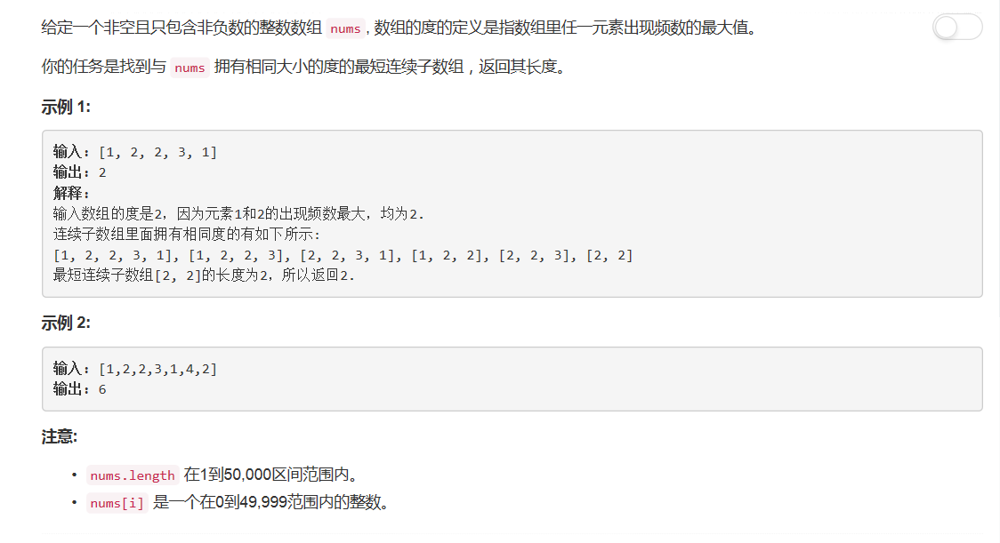

# 697 - 数组的度

## 题目描述


>审题：
emmm其实意思就是找出数组中出现次数最多的元素所在子数组的长度。
**要注意考虑不同元素出现次数都最大的情况**

## 题解
思路一：
1. 记录元素第一次出现的位置；
2. 判断元素是否出现次数最多，若是，更新最大值；
3. 判断元素是否出现次数最多的那个元素，若是，更新最短子序列长度。
 
```python
class Solution(object):
    def findShortestSubArray(self, nums):
        """
        :type nums: List[int]
        :rtype: int
        """
        firstAppear = {}    # 保存元素第一次出现的下标
        counter = {}        # 保存元素出现次数
        mostTime = 0        # 出现最多的次数
        subLen = 0          # 子数组长度
        for i, v in enumerate(nums):
            firstAppear.setdefault(v, i)    # 若字典中已经有此key的记录则保留，否则添加新的
            counter[v] = counter.get(v, 0) + 1
            if counter[v] > mostTime:
                mostTime = counter[v]
                subLen = i - firstAppear[v] + 1
            elif counter[v] == mostTime:
                subLen = min(subLen, i - firstAppear[v] + 1)
        return subLen
```
