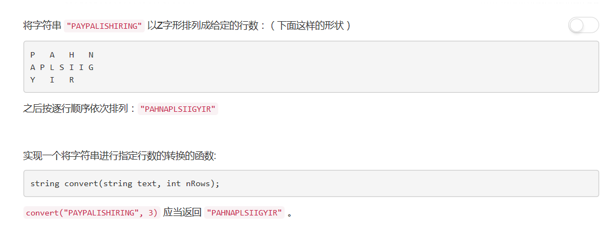
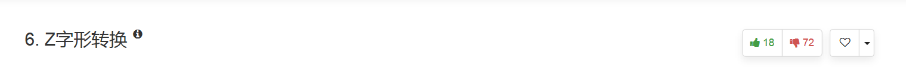
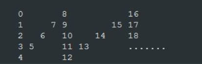

# 6 - Z字形转换

## 题目描述


<!-- more -->

看到题目的时候一脸懵逼，这啥呀，啥Z字形啊咋排的呀，怪不得这么多人给了unlike嚯嚯嚯。。。



事实证明，只有行数多了才能看出这个z，下图是直接用下标排的，一共5行。




## 思路：遍历计算每一个字符属于哪一行

### 1. 控制Z字方向遍历
```python
import numpy as np
class Solution:
    def convert(self, s: str, numRows: int) -> str:
        if numRows == 1: return s
        
        reindexStr = [''] * min(numRows, len(s))    # 字符串数组，保存每一行对应的字符串
        curRow = 0                                  # 当前为Z字的第几行
        goingDown = False                           # 方向是否沿Z字型向下(判断0时会取反所以初始化为False)
        
        for i in range(len(s)):
            reindexStr[curRow] += s[i]
            if curRow == 0 or curRow == numRows - 1: 
                goingDown = bool( 1 - goingDown )    # 第一行和最后一行时转换方向
            curRow += 1 if goingDown else -1
        return ''.join(reindexStr)

```python


### 2. Z字每一折作为一个遍历单位
1. 一共N行时，total = 2*(N-1)个字符组成一个完整序列，即Z字的前两划；
2. 每total个字符为一组，计算这一组中每个字符在第几行；
3. 从第一行开始，把每一行的字符拼接起来返回。

```python
class Solution:
    def convert(self, s, numRows):
        """
        :type s: str
        :type numRows: int
        :rtype: str
        """
        if numRows == 1:
        	return s

        l = len(s)
        total = 2 * (numRows - 1)
        tmp = []
        ret = ''

        for k in range(numRows):
        	tmp.append('')

        for i in range(l):
        	idx = i % total
        	if idx >= numRows:
        		idx = total - idx
        	tmp[idx] += s[i]

        for j in range(numRows):
        	ret += tmp[j]
        return ret
```

自测是没有问题的，提交了三次都提交不上去，我也只好unlike了( ･´ω`･ )
恩恩好了好了AC了嚯嚯嚯


