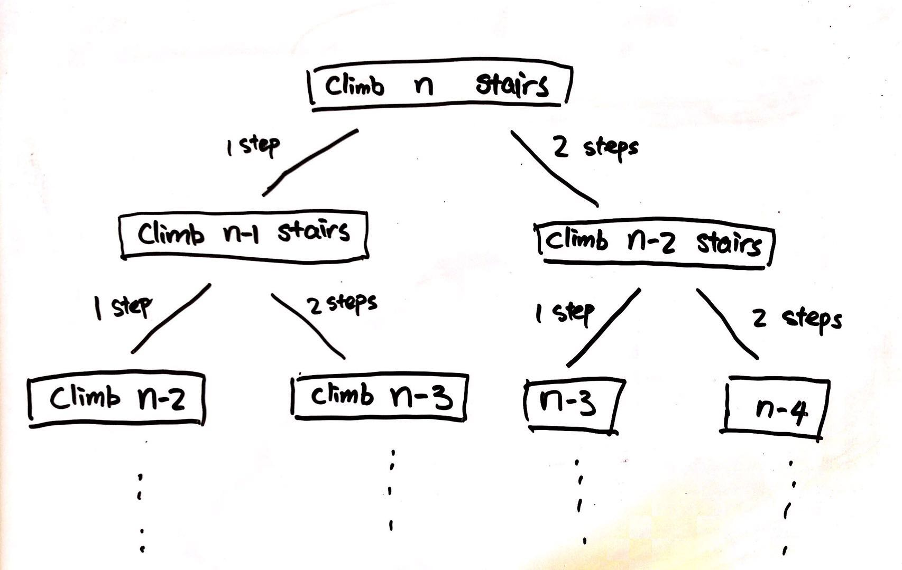

# 70 - 加一

## 题目描述


>这是[大佬以这题为例讲解DP](https://leetcode.com/problems/climbing-stairs/discuss/163347/Python-3000DP-or-tm), 本菜菜照着这个步骤一步步走了一遍。


## 题解一：recursive

**思路：** 爬上(n)阶楼梯的方案 = 爬上( n - 1 )阶楼梯的方案 + 爬上( n - 2 )阶楼梯的方案。 如下图：



>嚯嚯嚯， TLE了...为什么TLE了呢，因为你看看啊，上面递归算法有好多重复计算啊，指数级的时间复杂度很累的呀,,ԾㅂԾ,,

```python
class Solution(object):
    def climbStairs(self, n):
        """
        :type n: int
        :rtype: int
        """
        if n == 1: return 1
        if n == 2: return 2
        return self.climbStairs(n -1) + self.climbStairs(n - 2)
```


## 题解二: 使用array的边界recursive， Top-Down
**思路：**
1. 为了把时间复杂度改进到O(N)加了点空间复杂度O(N);
2. 使用一个初始化为全-1的数组，arr[i]表示第i阶的方案，如果不为-1则已经被计算，就不用重复计算啦；
3. 使用和上面一样的思路，从最大的问题开始一直递归搜索到原子问题。

> beat 33.4%

```python
class Solution(object):
    def climbStairs(self, n):
        """
        :type n: int
        :rtype: int
        """
        if n == 1: return 1
        steps = [-1] * n
        steps[0], steps[1] = 1, 2   # 1阶和2阶的方案分别为1种和2种，这是基本问题
        return self.np(n - 1, steps)

    def np(self, i, steps):
        if steps[i] == -1:
            steps[i] = self.np(i - 1, steps) + self.np(i - 2, steps)
        return steps[i]
```


## 题解三: 使用array的recursive， Bottom-Up
**思路：**
1. 同样空间换时间，换的值啊hh；
2. 从原子问题向上累加，直到解出最终问题。

```python
class Solution(object):
    def climbStairs(self, n):
        """
        :type n: int
        :rtype: int
        """
        if n == 1: return 1
        steps = [0] * n
        steps[0], steps[1] = 1, 2   # 1阶和2阶的方案分别为1种和2种，这是基本问题
        for i in range(2, n):
            steps[i] = steps[i - 1] + steps[i - 2]
        return steps[n - 1]
```


## 题解四: 不使用array的Bottom-up　【大BOSS】

**思路：** 和三一样一样的，就是没有用额外的空间啦~

>四舍五入就beat 88%了嚯嚯嚯

```python
class Solution(object):
    def climbStairs(self, n):
        """
        :type n: int
        :rtype: int
        """
        if n == 1: return 1
        a, b = 1, 2   # 1阶和2阶的方案分别为1种和2种，这是基本问题
        for _ in range(2, n):
            a, b = b, a + b
        return b
```