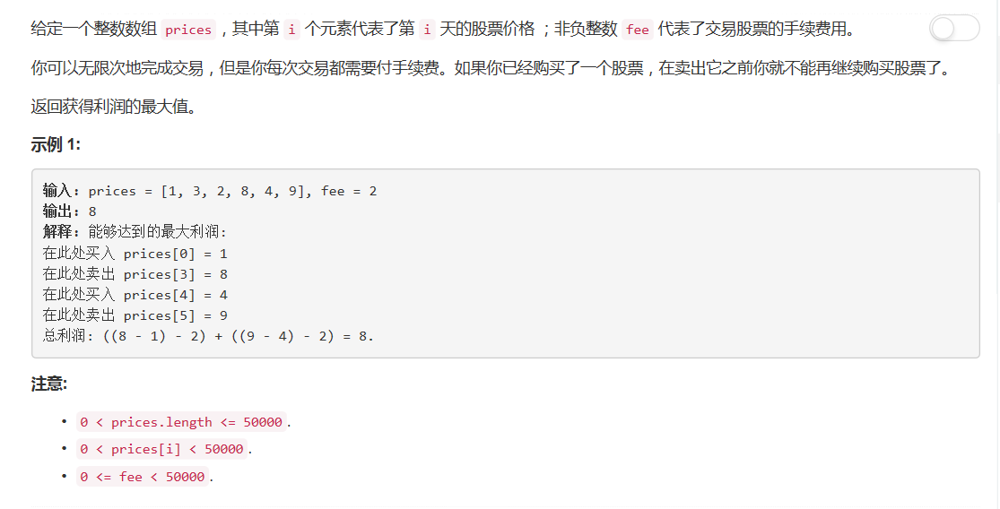

# 714 - 买卖股票的最佳时机含手续费

## 题目描述


>关联题目：  
- [121. 买卖股票的最佳时机](https://github.com/Rosevil1874/LeetCode/tree/master/Python-Solution/121_Best-Time-to-Buy-and-Sell-Stock)
- [122. 买卖股票的最佳时机II](https://github.com/Rosevil1874/LeetCode/tree/master/Python-Solution/122_Best-Time-to-Buy-and-Sell-Stock-II)
- [123. 买卖股票的最佳时机III](https://github.com/Rosevil1874/LeetCode/tree/master/Python-Solution/123_Best-Time-to-Buy-and-Sell-Stock-III)
- [188. 买卖股票的最佳时机IV](https://github.com/Rosevil1874/LeetCode/tree/master/Python-Solution/188_Best-Time-to-Buy-and-Sell-Stock-IV)
- [309. 买卖股票的最佳时机含冷冻期](https://github.com/Rosevil1874/LeetCode/tree/master/Python-Solution/309_Best-Time-to-Buy-and-Sell-Stock-with-Cooldown)

>审题：  
此题仍是[122. 买卖股票的最佳时机II](https://github.com/Rosevil1874/LeetCode/tree/master/Python-Solution/122_Best-Time-to-Buy-and-Sell-Stock-II)的进阶版，这里加的条件是：**每次交易都需要付手续费**。

## 动态规划
解决方式类似于[309. 买卖股票的最佳时机含冷冻期](https://github.com/Rosevil1874/LeetCode/tree/master/Python-Solution/309_Best-Time-to-Buy-and-Sell-Stock-with-Cooldown)

状态图：


最后取返回notHold，是因为当最后手中的股票都卖出了才可能得到最大收益。

```python
class Solution(object):
    def maxProfit(self, prices, fee):
        """
        :type prices: List[int]
        :type fee: int
        :rtype: int
        """
        not_hold = 0                         # 开始状态
        hold = float('-inf')                # 不可能一开始就持有股票
        for p in prices:
            hold = max(hold, not_hold - p - fee)         # 一直持有股票或买了股票
            not_hold = max(not_hold, hold + p)            # 一直未持有股票或卖了股票
        return not_hold
```
