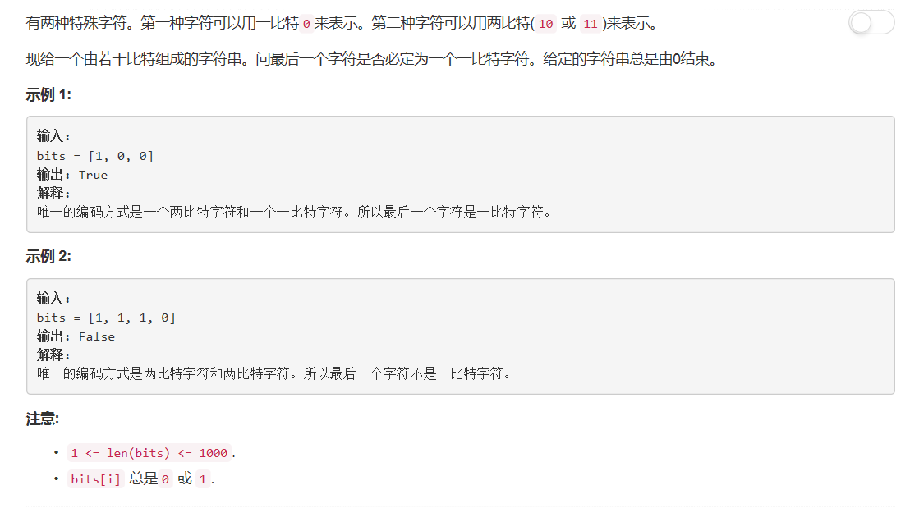

# 717 - 1比特与2比特字符

## 题目描述


## 题解
思路：  
由于两比特字符表示为`10`或`11`，所以以1开始的编码肯定和其后的数字组成两比特字符。遍历数组：  
    - 若当前为数组最后一个数，说明由其开始编码，即为1比特字符，返回True；
    - 否则若值为1，说明和其后一位组成2比特字符，索引+2；
    - 否则若值为0，说明是1比特字符，索引+1；
若遍历结束未访问到最后一位，说明其与倒数第二位组成了2比特字符，返回False。

```python
class Solution(object):
    def isOneBitCharacter(self, bits):
        """
        :type bits: List[int]
        :rtype: bool
        """
        i = 0
        while i < len(bits):
            if i == len(bits) - 1:
                return True
            elif bits[i] == 1:
                i += 2
            else:
                i += 1
        return False
```
