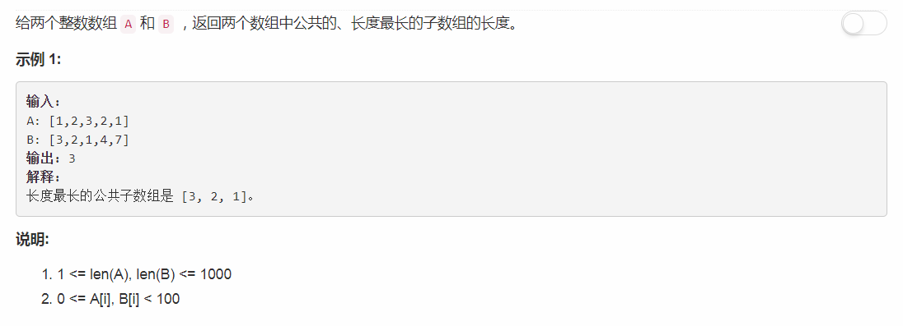

# 718 - 最长重复子数组

## 题目描述


>关联题目： [209. 长度最小的子数组](https://github.com/Rosevil1874/LeetCode/tree/master/Python-Solution/209_Minimum-Size-Subarray-Sum)    

>最长公共子序列(LCS)啊同志们！动态规划啊妥妥的，咦~我去翻个书先/嘻嘻 

## DP
思路：  
1. c[i][j]代表A(0~i), B(0~j)的LCS长度；
2. dp方程为：
    - c[i][j] = 0; if i ==0 and j == 0
    - c[i][j] = c[i - 1][j - 1] + 1; if i > 0 and j > 0 and A[i] == B[j]
    - c[i][j] = max( c[i - 1][j], c[i][j - 1] ); if i > 0 and j > 0 and A[i] != B[j]

```python
class Solution:
    def findLength(self, A, B):
        """
        :type A: List[int]
        :type B: List[int]
        :rtype: int
        """
        m, n = len(A), len(B)
        maxLen = float('-inf')
        c = [[0] * (n + 1) for i in range(m + 1)]
        for i in range(1, m + 1):
            for j in range(1, n + 1):
                if A[i - 1] == B[j - 1]:
                    c[i][j] = c[i - 1][j - 1] + 1
                    maxLen = max(maxLen, c[i][j])
        return 0 if maxLen == float('-inf') else maxLen
```
