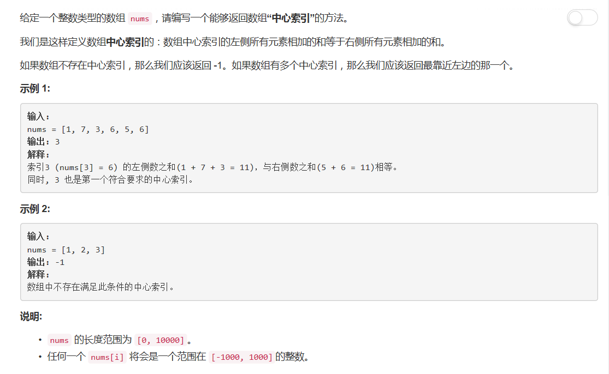

# 724 - 寻找数组的中心索引

## 题目描述


## 题解一：超时
思路：  
emmm就是暴力解决，遍历数组，计算每个索引左右元素之和是否相等，若相等就返回当前索引。由于遍历是从头开始，找到的第一个就是最左的中心索引。  

```python
class Solution(object):
    def pivotIndex(self, nums):
        """
        :type nums: List[int]
        :rtype: int
        """
        for i in range(len(nums)):
            if i == 0:
                if sum( nums[1:] ) == 0:
                    return 0
            elif i == len(nums) - 1:
                if sum( nums[:len(nums) - 1]) == 0:
                    return len(nums) - 1
            # print(i, sum(nums[:i]), sum(nums[i+1:]))
            elif sum(nums[:i]) == sum(nums[i+1:]):
                return i
        return -1
```

## 题解二
**时间复杂度O(N), 空间复杂度O(1)**
>cr: [Short Python O(n) time O(1) space with Explanation](https://leetcode.com/problems/find-pivot-index/discuss/109255/Short-Python-O(n)-time-O(1)-space-with-Explanation)  

思路：  
其实思路和我上面还是一样的，只不过不用每次重新算sum，每向后遍历一个数就left+val同时right-val。唉其实读他的思路的第一句我就豁然开朗了，自己还是个菜鸡，这么简单的方法都没想到。。。
```python
class Solution(object):
    def pivotIndex(self, nums):
        """
        :type nums: List[int]
        :rtype: int
        """
        left, right = 0, sum(nums)
        for i, v in enumerate(nums):
            right -= v
            if left == right:
                return i
            left += v
        return -1
```