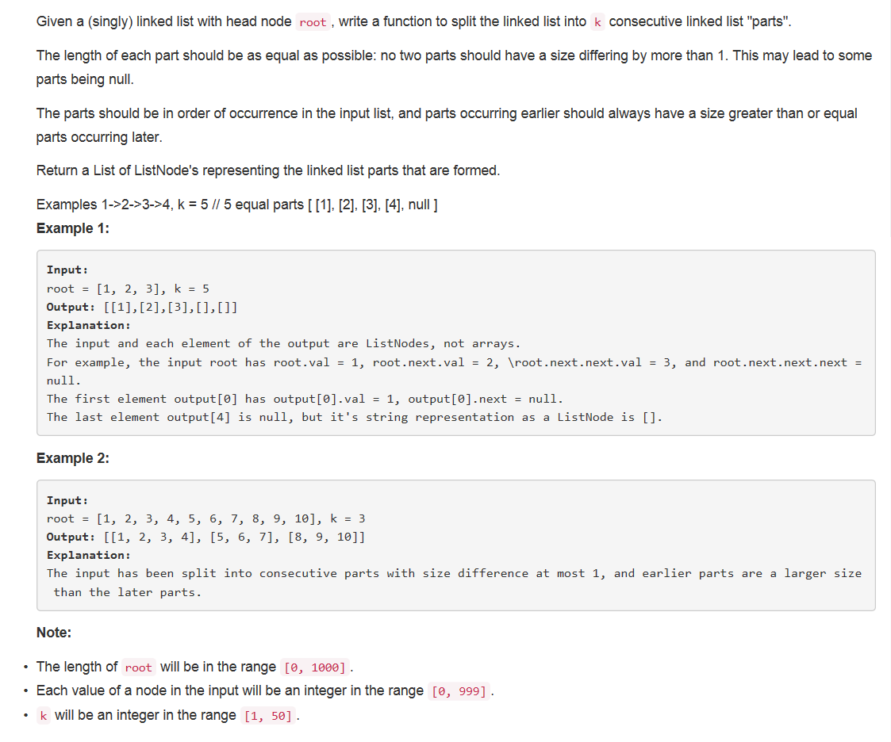

# 725 - Split Linked List in Parts 【链表分割】

## 题目描述


>审题：
英文题干一定要好好审啊_(:з」∠)_ 
1. 给出单链表头结点root，将其分割成k个连续的部分；
2. 每部分的长度尽可能相同，长度差最大为1，最短的部分可以为空；
3. 元素相对位置不变，且前面的部分长度大于等于后面的；
4. 返回二维数组，第二维为分割后的每个部分。

## 题解
思路：
1. 计算链表长度；
2. 根据链表长度和k计算k个部分每个部分的长度；
3. 遍历链表将结点值拿出来分组，返回的是子链表的头结点数组。


```python
# Definition for singly-linked list.
# class ListNode(object):
#     def __init__(self, x):
#         self.val = x
#         self.next = None

class Solution(object):
    def splitListToParts(self, root, k):
        """
        :type root: ListNode
        :type k: int
        :rtype: List[ListNode]
        """
        if not root:
            return [None]*k

        curr = root
        length = 1
        while curr.next:
            length += 1
            curr = curr.next

        parts_len = length // k             # 每个部分的长度，长的部分比起多1
        long_parts_len = parts_len + 1      # 每个部分的长度，长的部分比起多1
        long_num = length % k               # 比较长的部分的个数

        curr = root
        res = []
        for i in range(long_num):
            part = root
            n = long_parts_len
            while n > 1 and root:
                root = root.next
                n -= 1
            tmp = root.next
            root.next = None
            root = tmp
            res.append(part)
        for i in range(long_num, k):
            part = root
            n = parts_len
            while n > 1 and root:
                root = root.next
                n -= 1
            if root:
                tmp = root.next
                root.next = None
            else:
                tmp = None
            root = tmp
            res.append(part)
        return res
```

## debug
当链表为空时，应该返回k个空链表：

特殊情况判断语句：
```python
if not root:
    return []
```
改为
```python
if not root:
    return [None] * k
```