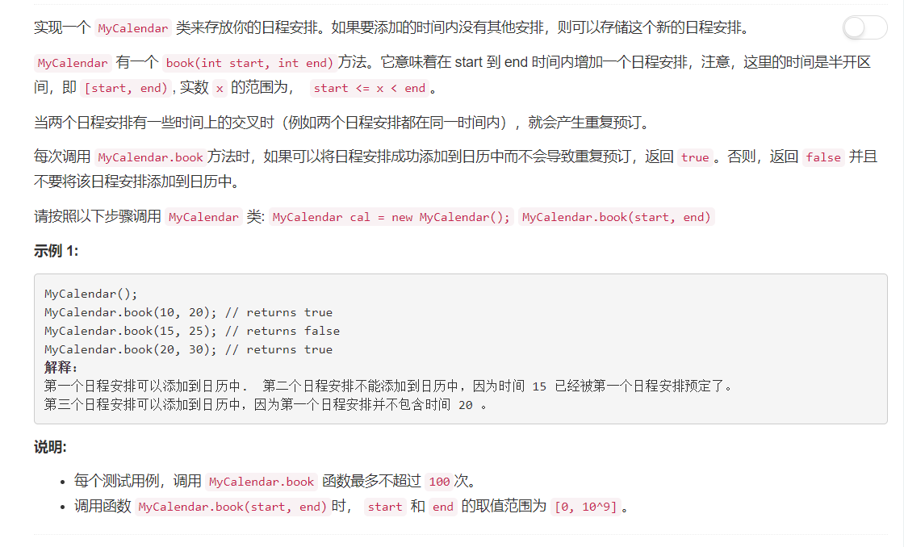

# 729 - 我的日程安排表

## 题目描述


>关联题目：  
- [731. 买卖股票的最佳时机II](https://github.com/Rosevil1874/LeetCode/tree/master/Python-Solution/731_MyCalendar-II)
- [732. 买卖股票的最佳时机III](https://github.com/Rosevil1874/LeetCode/tree/master/Python-Solution/732_MyCalendar-III)

## 题解一
第一反应就是把一个个已经安排好的日程放到一个容器里，新来的日程与安排好的日程一个个比较，要是冲突就返回False，否则加入日程表并返回Ture。  
于是产生了以下解：
```python
class MyCalendar:

    def __init__(self):
        self.intervals = []

    def book(self, start, end):
        """
        :type start: int
        :type end: int
        :rtype: bool
        """
        for s, e in self.intervals:
        	if not(start >= e or end <= s):
        		return False
        self.intervals.append((start, end))
        return True
```
但是在discuss区我发现，诶不对呀，怎么大家都在用红黑树啊二分搜索树这样的树结构哇。  
并且，我在一个类似这种简单解法下面看到一个评论：  
>"You will probably get rejected if you do this in interview, since this is not the most optimized one."  

哈哈哈哈/苦笑，好的我改还不行吗。


## 题解二
>EMMMM由于Python中没有实现这样的树结构，构造一个红黑树有些麻烦，还要旋转啥的，于是就使用二分搜索树吧。  
refer to: [Binary Search Tree python](https://leetcode.com/problems/my-calendar-i/discuss/109476/Binary-Search-Tree-python)

思路：
1. 树结点处保存s,e两个参数表明当前日程；
2. 若新建日程时树为空，直接将此日程作为根节点；
3. 沿根结点向下搜索：
	- 若与结点上的日程冲突，则返回False;
	- 若新日程start大于当前结点结束日期e：
		- 若存在右子树则向右子树继续搜索；
		- 否则将新日程作为右子结点插入；
	- 若新日程end小于当前结点开始日期s：
		- 若存在左子树则向左子树继续搜索；
		- 否则将新日程作为左子结点插入。
```python
class Node:
	def __init__(self, s, e):
		self.s = s
		self.e = e
		self.left = None
		self.right = None

class MyCalendar:

    def __init__(self):
        self.root = None

    def book_helper(self, start, end, node):
    	if start >= node.e:
    		if node.right:
    			return self.book_helper(start, end, node.right)
    		else:
    			node.right = Node(start, end)
    			return True

    	elif end <= node.s:
    		if node.left:
    			return self.book_helper(start, end, node.left)
    		else:
    			node.left = Node(start, end)
    			return True

    	else:
    		return False

    def book(self, start, end):
        """
        :type start: int
        :type end: int
        :rtype: bool
        """
        if self.root:
        	return self.book_helper(start, end, self.root)
        else:
        	self.root = Node(start, end)
        	return True
```