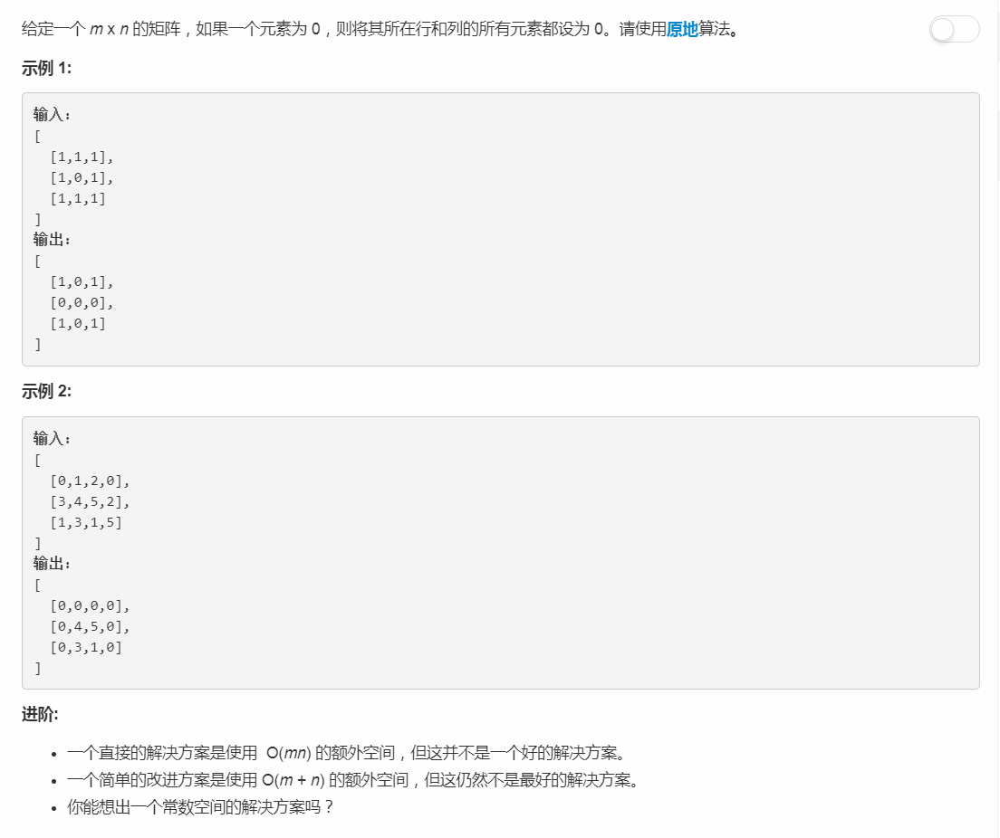

# 72 - 编辑距离

## 题目描述
<!--  -->
Given two words word1 and word2, find the minimum number of operations required to convert word1 to word2.

You have the following 3 operations permitted on a word:

- Insert a character
- Delete a character
- Replace a character


> 此题根据discussion区的回答[Python solutions and intuition](https://leetcode.com/problems/edit-distance/discuss/159295/Python-solutions-and-intuition)，从递归推导出动态规划解法。


## 解法一：递归
测试用例长度达到：
- word1："dinitrophenylhydrazine"
- word2："acetylphenylhydrazine"

就超时了，`Time Limit Exceeded`。

```python
class Solution:
    def minDistance(self, word1: str, word2: str) -> int:
        if not word1 and not word2:
            return 0
        elif not word1:
            return len(word2)
        elif not word2:
            return len(word1)
        elif word1[0] == word2[0]:
            return self.minDistance(word1[1:], word2[1:])
        
        insert = 1+ self.minDistance(word1, word2[1:])
        delete = 1+ self.minDistance(word1[1:], word2)
        replace = 1+ self.minDistance(word1[1:], word2[1:])  
        return min(insert, delete, replace)
```


## 解法二：递归+cache
题解一在递归中有大量重复子问题，其**时间复杂度是指数级的**。为了解决这个问题，我们将子问题的结果存储下来，当遇到重复的子问题不再重复递归，**优化后时间复杂度为O(MN)**。
> Runtime: 124 ms, faster than 91.30% of Python3 online submissions

```python
class Solution:
    def minDistance(self, word1: str, word2: str) -> int:
        return self.curr_min(word1, word2, 0, 0, {})
    
    
    def curr_min(self, word1, word2, i, j, memo):
        if i == len(word1) and j == len(word2):
            return 0
        elif i == len(word1):
            return len(word2) - j
        elif j == len(word2):
            return len(word1) - i
        
        if (i, j) not in memo:
            if word1[i] == word2[j]:
                cnt = self.curr_min(word1, word2, i + 1, j + 1, memo)
            else:
                insert = 1+ self.curr_min(word1, word2, i, j + 1, memo)
                delete = 1 + self.curr_min(word1, word2, i + 1, j, memo)    
                replace = 1 + self.curr_min(word1, word2, i + 1, j + 1, memo)    
                cnt = min(insert, delete, replace)
            memo[(i, j)] = cnt
        return memo[(i, j)]
```


### 解法三：动态规划
>Runtime: 176 ms, faster than 73.89% of Python3 online submissions

```python
class Solution:
    def minDistance(self, word1: str, word2: str) -> int:
        m, n = len(word1), len(word2)
        dp = [[0] * (n + 1) for _ in range(m + 1)]
        
        # dp[i][j]表示word1[:i]到word2[:j]
        for i in range(m + 1):
            dp[i][0] = i
        for j in range(n + 1):
            dp[0][j] = j
            
        for i in range(1, m + 1):
            for j in range(1, n + 1):
                if word1[i - 1] == word2[j - 1]:
                    dp[i][j] = dp[i - 1][j - 1]
                else:
                    dp[i][j] = 1 + min(dp[i][j - 1], dp[i - 1][j], dp[i - 1][j - 1])
        return dp[-1][-1]
```