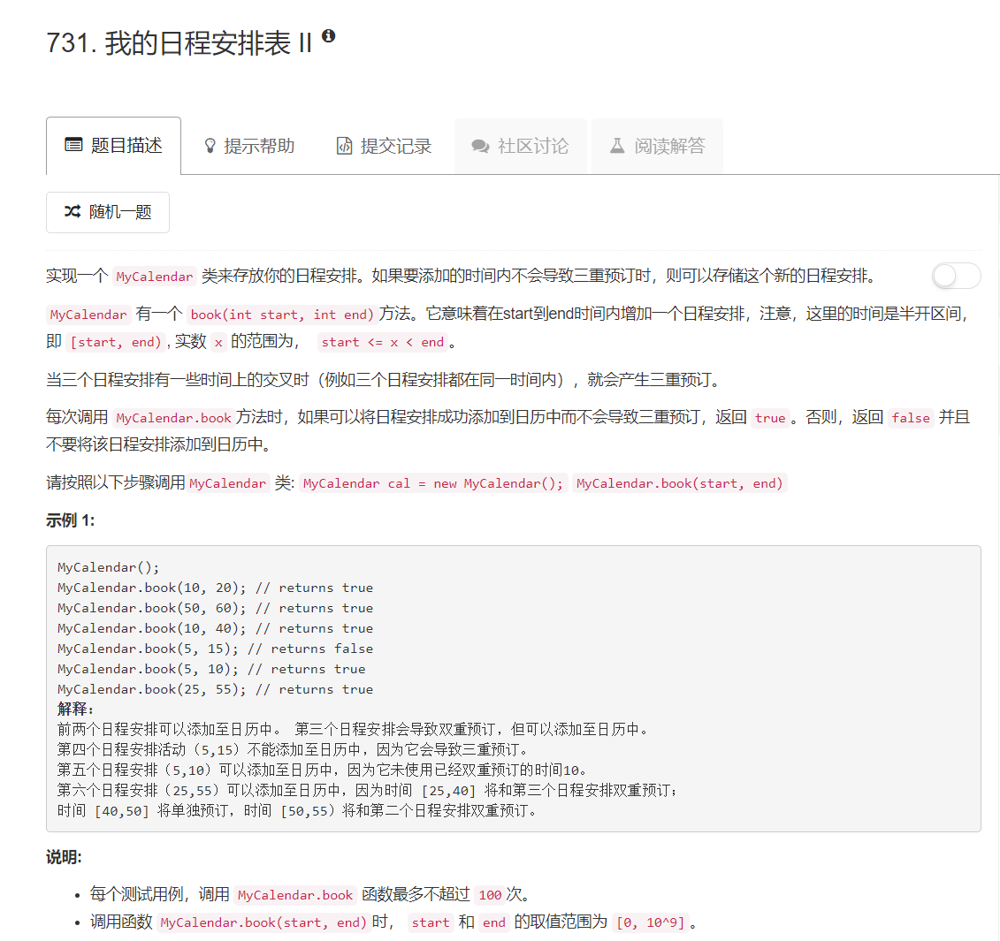

# 731 - 我的日程安排表 II

## 题目描述


>关联题目：  
- [729. 买卖股票的最佳时机](https://github.com/Rosevil1874/LeetCode/tree/master/Python-Solution/729_MyCalendar-I)
- [732. 买卖股票的最佳时机III](https://github.com/Rosevil1874/LeetCode/tree/master/Python-Solution/732_MyCalendar-III)

## 题解一
1. 使用两个list，overlaps存放两个重叠日程的重叠区域，calendar存放预定成功的日程（包括第一次成功，和与第一次成功日程冲突的日程）。  
2. 当有新日程需要预定时，首先将其与重叠区域对比，若其冲突则说明这是二次重叠，即共三个日程发生重叠，不可行，返回False。
3. 若与重叠区域不冲突则与成功预定的日程比较，若冲突则将重叠区域加入overlaps，仍将新日程加入calendar表示预定成功。

>reference: [N^2 Python, Short and Elegant](https://leetcode.com/problems/my-calendar-ii/discuss/109530/N2-Python-Short-and-Elegant)  
虽然时间复杂度比较高，但不可否认思路还是非常清晰易懂的  

```python
class MyCalendar:

    def __init__(self):
        self.intervals = []

    def book(self, start, end):
        """
        :type start: int
        :type end: int
        :rtype: bool
        """
        for s, e in self.intervals:
        	if not(start >= e or end <= s):
        		return False
        self.intervals.append((start, end))
        return True
```


## 题解二
在二分搜索树的基础上改的，结果是错误的，就是记录一下，还是不要看了吧。。。  
想法是在每个结点加一个conflict，初始化为False表示未发生冲突，当一个新日程第一次与其冲突将conflict改为True。
当第二个冲突的日程到来时发现conflict变为True，则不能加入。
```python
class Node:
    def __init__(self, s, e):
        self.s = s
        self.e = e
        self.left = None
        self.right = None
        self.conflict = False

class MyCalendarTwo:

    def __init__(self):
        self.root = None

    def book_helper(self, start, end, node):
        if start >= node.e:
            if node.right:
                return self.book_helper(start, end, node.right)
            else:
                node.right = Node(start, end)
                return True

        elif end <= node.s:
            if node.left:
                return self.book_helper(start, end, node.left)
            else:
                node.left = Node(start, end)
                return True

        else:
            if node.conflict:
                if start >= node.s and node.right:
                    return self.book_helper(start, end, node.right)
                elif end <= node.e and node.left:
                    return self.book_helper(start, end, node.left)
                else:
                    return False
            else:
                node.s = min(node.s, start)
                node.e = max(node.e, end)
                node.conflict = True
                return True

    def book(self, start, end):
        """
        :type start: int
        :type end: int
        :rtype: bool
        """
        if not self.root:
            self.root = Node(start, end)
            return True
        else:
            return self.book_helper(start, end, self.root)

```