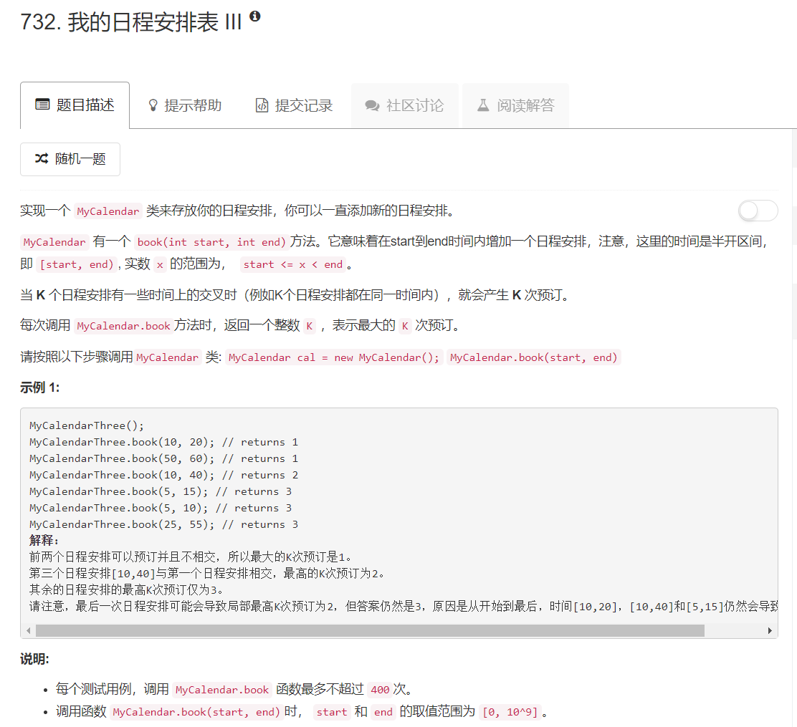

# 732 - 我的日程安排表 III

## 题目描述


>关联题目：  
- [729. 买卖股票的最佳时机](https://github.com/Rosevil1874/LeetCode/tree/master/Python-Solution/729_MyCalendar-I)
- [731. 买卖股票的最佳时机II](https://github.com/Rosevil1874/LeetCode/tree/master/Python-Solution/731_MyCalendar-II)

## 题解一
>reference: [N^2 Python, Short and Elegant](https://leetcode.com/problems/my-calendar-ii/discuss/109530/N2-Python-Short-and-Elegant)    
花了很久才理解，首先放上答主的原话：   
【**This is to find the maximum number of concurrent ongoing event at any time.**

>We can log the start & end of each event on the timeline, each start add a new ongoing event at that time, each end terminate an ongoing event. Then we can scan the timeline to figure out the maximum number of ongoing event at any time.

>The most intuitive data structure for timeline would be array, but the time spot we have could be very sparse, so we can use sorted map to simulate the time line to save space.(答主用的Java和C+++)】

解释一下:  
其实在myCalendar2里答主也是使用的这个方法，哎呀真的很巧妙哩👍  
1. 我们把每一个开始时间start的这个时刻的计数加1，把结束时间end的这个时刻计数-1；
2. 保证保存的容器按时间顺序排列，这里使用insect的insort函数自动排序（答主用的是map）；
3. 按时间线从前往后遍历，首先遍历到的肯定是一个开始时间，这里的值一定是正数，表示从这个时候开始，后面这段时间有多少件事情正在执行（ongoing）。此后，若又遇到正数则说明这里又新的事件在执行，需要累加起来；同理，若遇到负数则说明有事件到这里结束了。
4. 我们此题需求的是任意时间内同时发生的最大事件数，所以，累加过程中的最大值即为结果。  
完结撒花*★,°*:.☆(￣▽￣)/$:*.°★* 。

```python
from bisect import insort
class MyCalendarThree:

    def __init__(self):
        self.timeline = []

    def book(self, start, end):
        """
        :type start: int
        :type end: int
        :rtype: int
        """
        insort(self.timeline, (start, 1))
        insort(self.timeline, (end, -1))

        res, cumsum = 0, 0
        for _, x in self.timeline:
            cumsum += x
            res = max(res, cumsum)
        return res
```


## 题解二
在二分搜索树的基础上改的，结果是错误的，就是记录一下，还是不要看了吧。。。  
想法是在每个结点加一个conflict，初始化为False表示未发生冲突，当一个新日程第一次与其冲突将conflict改为True。
当第二个冲突的日程到来时发现conflict变为True，则不能加入。
```python
class Node:
    def __init__(self, s, e):
        self.s = s
        self.e = e
        self.left = None
        self.right = None
        self.conflict = False

class MyCalendarTwo:

    def __init__(self):
        self.root = None

    def book_helper(self, start, end, node):
        if start >= node.e:
            if node.right:
                return self.book_helper(start, end, node.right)
            else:
                node.right = Node(start, end)
                return True

        elif end <= node.s:
            if node.left:
                return self.book_helper(start, end, node.left)
            else:
                node.left = Node(start, end)
                return True

        else:
            if node.conflict:
                if start >= node.s and node.right:
                    return self.book_helper(start, end, node.right)
                elif end <= node.e and node.left:
                    return self.book_helper(start, end, node.left)
                else:
                    return False
            else:
                node.s = min(node.s, start)
                node.e = max(node.e, end)
                node.conflict = True
                return True

    def book(self, start, end):
        """
        :type start: int
        :type end: int
        :rtype: bool
        """
        if not self.root:
            self.root = Node(start, end)
            return True
        else:
            return self.book_helper(start, end, self.root)

```