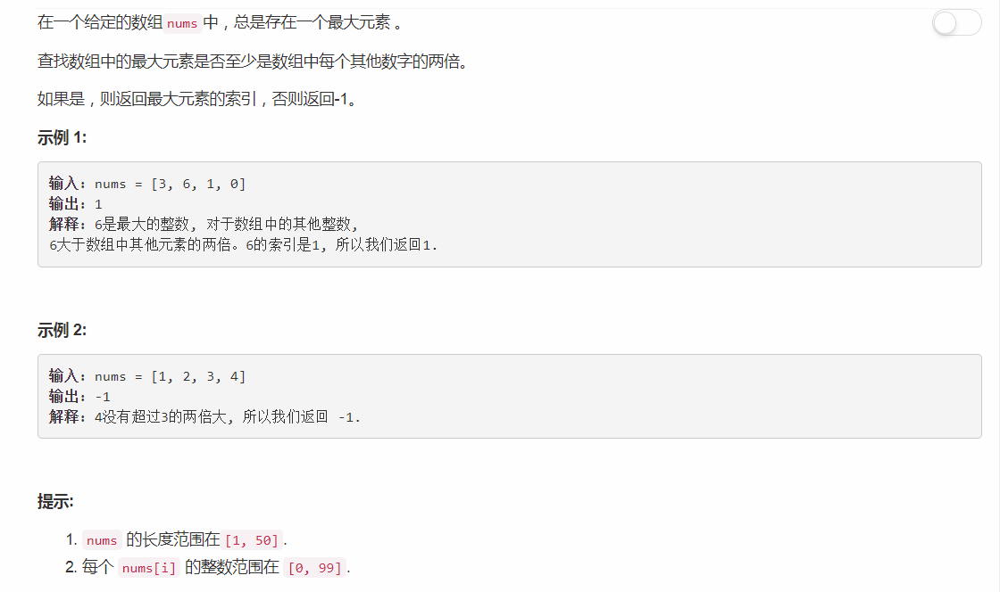

# 747 - 至少是其他数字两倍的最大数

## 题目描述


## 一、使用max函数
**时间复杂度O(N)**
```python
class Solution:
    def dominantIndex(self, nums):
        """
        :type nums: List[int]
        :rtype: int
        """
        n = len(nums)
        if n == 0:
        	return -1
        elif n == 1:
        	return 0

        maxNum = max(nums)
        maxIdx = nums.index(maxNum)
        del nums[maxIdx]

        secondNum = max(nums)
        return maxIdx if maxNum >= (2 * secondNum) else -1
```

## 二、遍历标注
**时间复杂度O(N)**
```python
class Solution:
    def dominantIndex(self, nums):
        """
        :type nums: List[int]
        :rtype: int
        """
        maxIdx = -1
        maxNum = float('-inf')
        secondNum = float('-inf')

        for i in range(len(nums)):
        	if nums[i] > maxNum:
        		secondNum = maxNum
        		maxNum = nums[i]
        		maxIdx = i
        	elif nums[i] > secondNum:
        		secondNum = nums[i]
        return maxIdx if maxNum >= (2 * secondNum) else -1
```