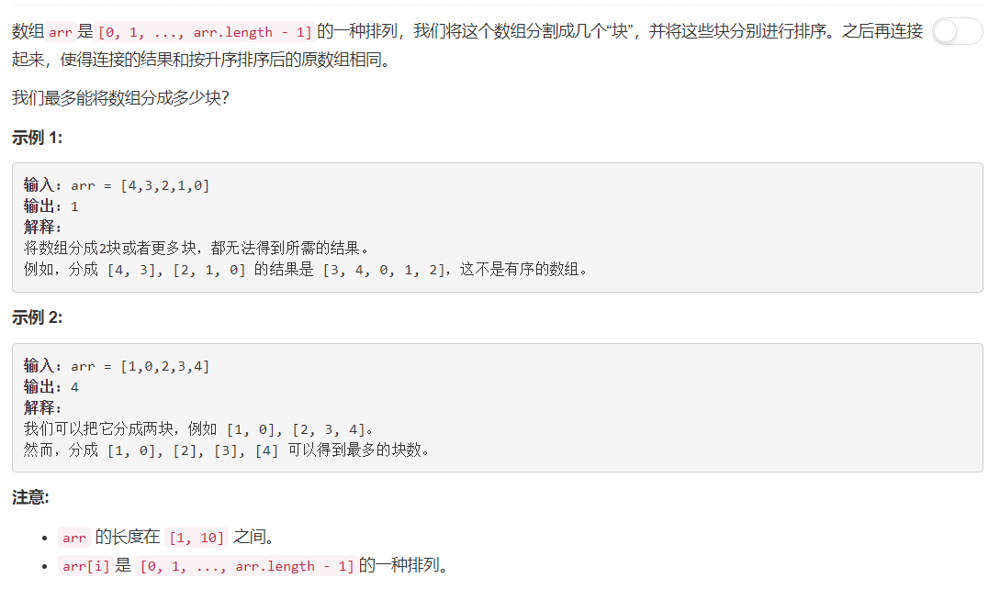

# 769 - 最多能完成排序的块

## 题目描述


>相似题目：  
[768.最多能完成排序的块 II](https://github.com/Rosevil1874/LeetCode/tree/master/Python-Solution/768_Max-Chunks-To-Make-Sorted-II)


## 题解
**思路：**  
1. 要每个块排序后连在一起和原list排序后相同，那么所分的块之间相对顺序也应该是严格递增；
2. 检查从第零个元素开始的每个“前i个元素”子数组，若其包含的元素为排序后list的前i个元素，则其属于同一块中，否则后面的需再加一块才能表示。

```python
class Solution:
    def maxChunksToSorted(self, arr):
        """
        :type arr: List[int]
        :rtype: int
        """
        sortedArr = sorted(arr)
        i, cnt = 1, 0
        while i <= len(arr):
            while sorted(arr[:i]) != sortedArr[:i] and i <= len(arr):
                i += 1
            cnt += 1
            i += 1
        return cnt
```
