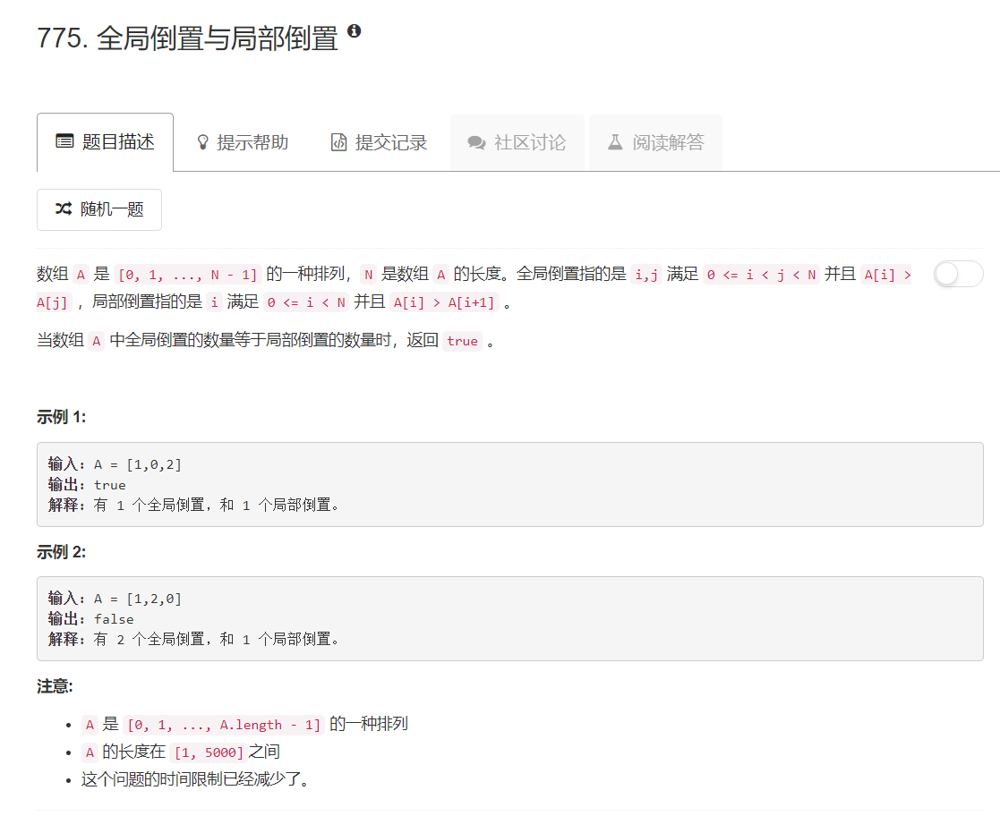

# 775 - 全局倒置与局部倒置

## 题目描述



## 题解
**思路：**  
太妙了！觉得自己的语言很苍白，直接放答主原话吧，看完之后觉得，果真是数学题。  

The original order should be [0, 1, 2, 3, 4...], the number i should be on the position i. We just check the offset of each number, if the absolute value is larger than 1, means the number of global inversion must be bigger than local inversion, because a local inversion is a global inversion, but a global one may not be local.

proof:

If A[i] > i + 1, means at least one number that is smaller than A[i] is kicked out from first A[i] numbers, and the distance between this smaller number and A[i] is at least 2, then it is a non-local global inversion.
For example, A[i] = 3, i = 1, at least one number that is smaller than 3 is kicked out from first 3 numbers, and the distance between the smaller number and 3 is at least 2.

If A[i] < i - 1, means at least one number that is bigger than A[i] is kicked out from last n - i numbers, and the distance between this bigger number and A[i] is at least 2, then it is a non-local global inversion.

>参考：[My 3 lines C++ Solution](https://leetcode.com/problems/global-and-local-inversions/discuss/113656/My-3-lines-C%2B%2B-Solution)


为了帮助理解，lee215是这样说的：  
All local inversions are global inversions.
If the number of global inversions is equal to the number of local inversions,
it means that all global inversions in permutations are local inversions.
It also means that we can not find A[i] > A[j] with i+2<=j.
In other words, max(A[i]) < A[i+2]

```python
class Solution:
    def isIdealPermutation(self, A):
        """
        :type A: List[int]
        :rtype: bool
        """
        for i in range(len(A)):
        	if abs(A[i] - i) > 1:
        		return False
        return True
```
