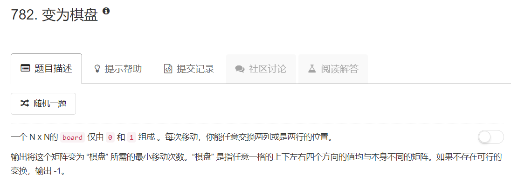
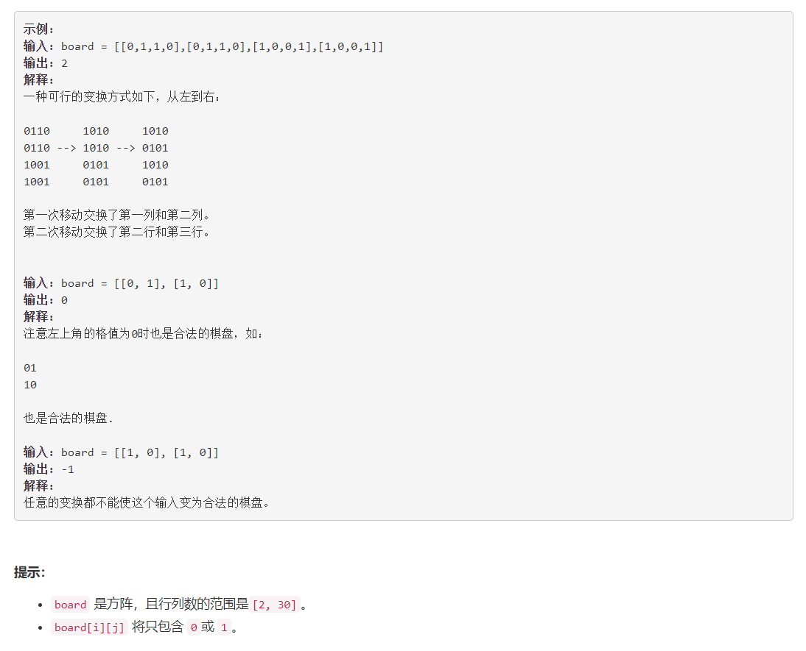

# 915 - 变为棋盘

## 题目描述




## 题解
想了半天也没有出来一个可行的方法，于是又跑去直接看discuss了，哎我这样会不会越来越笨哦＞︿＜  
**思路：**  
解题前先看一下两个规律，这两个规律是证明一个矩形是“棋盘”必要不充分条件：  
1. 棋盘中有且只有两种行和两种列，且两种行中和两种列中对应的元素都是相反的（一“0”一“1”），比如例一中只有两种行“0110”和“1001”，且其中每两个对应位置的元素都是相反的。且由此可知，棋盘中任意一个矩形四个角上的元素只能是四个0、四个1，或两个0加两个1，不可能出现奇数的情况。

2. 任意一行或一列中0和1的个数是平分的，例如若棋盘规模为 N * N:
当 N = 2*K 时, 每行和每列中都有K个0和K个1.
当 N = 2*K + 1 时, 每行和每列中都有K个0和K+1个1，或者有K个1和K+1个0.


一旦证明矩形满足以上条件，就可以开始进行交换操作了，否则这个矩形不能转化为“棋盘”
1. 把第一行转化为01010或者10101，这时所有相关的列都会移动，这里选择转化为010101...的形式；
2. 计算交换行和交换列中最小的交换次数：
	- 矩阵规模为奇数时，取交换偶数次的情况(偶数次较少)
	- 矩阵规模为偶数时，使用min函数取交换次数最少的情况

>参考：[Easy and Concise Solution with Explanation [C++/Java/Python]](https://leetcode.com/problems/transform-to-chessboard/discuss/114847/Easy-and-Concise-Solution-with-Explanation-C%2B%2BJavaPython)

```python
class Solution:
    def partitionDisjoint(self, A):
        """
        :type A: List[int]
        :rtype: int
        """
        left_max = A[0]
        all_max = left_max
        partition_index = 0
        for i in range(1, len(A)):
            if left_max <= A[i]:
                all_max = max( all_max, A[i] )
            else:
                left_max = all_max
                partition_index = i
        return partition_index + 1
```
