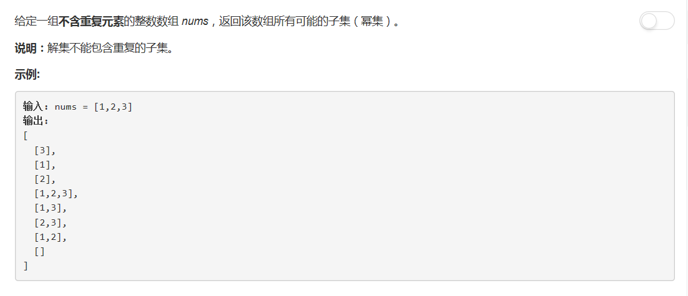

# 78 - 子集

## 题目描述


## 回溯法
```python
class Solution(object):
    def subsets(self, nums):
        """
        :type nums: List[int]
        :rtype: List[List[int]]
        """
        nums.sort()
        res = set()

        self.backtrack(res, [], nums, 0)
        return list( map(list, res) )

    def backtrack(self, res, tmp, nums, start):
    	res.add(tuple(tmp))
    	for i in range(start, len(nums)):
    		self.backtrack(res, tmp + [nums[i]], nums, i + 1) 
```
