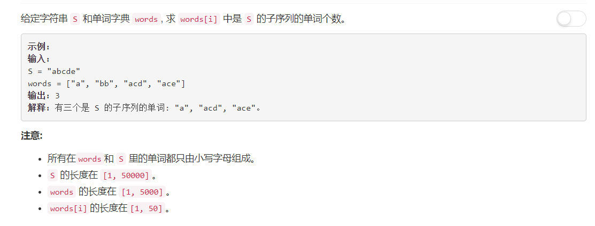

# 792 - 匹配子序列的单词数

## 题目描述



## 题解一
**思路：**  
1. 把数组中每个单词依次和字符串比较，判断是否是其子串；
2. 子串判断方法为，在字符串中依次查找单词中的每个字符，若每个字符都在字符串中且相对顺序正确，则此单词为字符串的子串。

```python
class Solution:
    def numMatchingSubseq(self, S, words):
        """
        :type S: str
        :type words: List[str]
        :rtype: int
        """
        cnt = 0
        for word in words:
            pre_pos = -1
            for i in range(len(word)):
                pos = S.find(word[i], pre_pos+1)
                if pos > pre_pos:
                    pre_pos = pos
                else:
                    i -= 1
                    break
            if i == len(word) - 1:
                cnt += 1
        return cnt
```


## 题解二  
it is time to look look big god  "StefanPochmann"  


```python
import collections
class Solution:
    def numMatchingSubseq(self, S, words):
        """
        :type S: str
        :type words: List[str]
        :rtype: int
        """
        waiting = collections.defaultdict(list)
        for word in words:
            waiting[word[0]].append(iter(word[1:]))
        for c in S:
            for it in waiting.pop(c, ()):
                waiting[next(it, None)].append(it)
        return len(waiting[None])
```