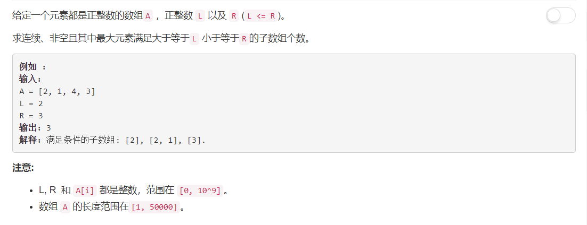
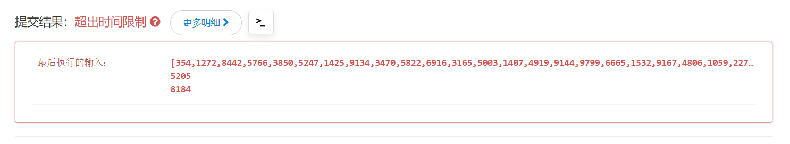

# 795 - 区间子数组的个数

## 题目描述



## 方法一
**思路：**  
依次遍历长度为 1~n（n为数组长度）的子序列，判断其最大值是否满足在L和R之间，若满足则计数加一。  
代码如下：
```python
class Solution:
    def numSubarrayBoundedMax(self, A, L, R):
        """
        :type A: List[int]
        :type L: int
        :type R: int
        :rtype: int
        """
        cnt = 0
        for i in range(1, len(A) + 1):
            j = 0
            while j + i <= len(A):
                m = max( A[j : j + i] )
                if m >= L and m <= R:
                    cnt += 1
                j += 1
        return cnt
```
然而，当我迅速完成并检测测试用例之后，我就觉得不对。。。以我这技术怎么可能如此干净利落呢⊙﹏⊙‖∣  
果然，超时了。。。  



## 方法二
**变量：**  
left：符合条件子序列的最左端元素下标为 left+1；
right： 符合条件子序列最右端元素下标
**思路：**  
依次判断每个元素A[i]的值：
1. 若A[i] > R，说明以A[i]作为结尾的子序列已经不满足条件，调节left=i，找下一个满足的子序列；
2. 若A[i] >= L，说明A[i]是满足条件的，将其作为子序列的最后一个元素，即right = i；
3. cnt的值加上当前找到的子序列的长度。

```python
class Solution:
    def numSubarrayBoundedMax(self, A, L, R):
        """
        :type A: List[int]
        :type L: int
        :type R: int
        :rtype: int
        """
        cnt , left, right = 0, -1 , -1
        for i in range(len(A)):
            if A[i] > R:
                left = i
            if A[i] >= L:
                right = i
            cnt += right - left
        return cnt
```