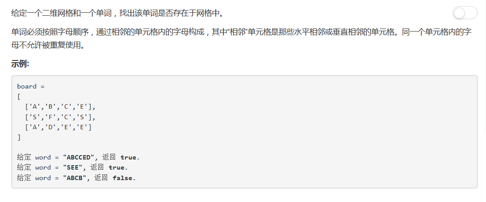

# 79 - 单词搜索

## 题目描述


>关联题目： [212. 单词搜索II](https://github.com/Rosevil1874/LeetCode/tree/master/Python-Solution/212_Word-Search-II)  
>知识点： [BFS & DFS](https://github.com/Rosevil1874/LeetCode/tree/master/Summary/BFS & DFS)

## DFS + 回溯
>虽然难度是中等，但是DFS也是好久没用过了，所以参考了一下别人的思路。

思路：
1. 遍历矩阵，分别以每一个元素为起点开始深度遍历；
2. 若索引超出范围或当前元素不匹配，返回False；
3. 若当前元素匹配，则将当前元素标记为已访问，并递归遍历矩阵中下一个（上下左右四个方向）元素，即往深处遍历；
4. 若某一元素不匹配，回溯（当前元素标记为未访问），选取下一个元素为起点DFS；
5. 递归边界：单词中所有字母均匹配。

```python
class Solution(object):
    def exist(self, board, word):
        """
        :type board: List[List[str]]
        :type word: str
        :rtype: bool
        """
        if not board:
            return False

        for i in range(len(board)):
        	for j in range(len(board[0])):
        		if self.DFS(board, i, j, word):
        			return True
        return False

    def DFS(self, board, i, j, word):
    	# 所有字母都存在
    	if len(word) == 0:
    		return True
    	if i < 0 or i >= len(board) or j < 0 or j >= len(board[0]) or word[0] != board[i][j]:
    		return False
    	tmp = board[i][j]		# 第一个字母匹配，接着判断剩下的
    	board[i][j] = '#'		# 代表已经访问过哦
    	if self.DFS(board, i + 1, j, word[1:]) or self.DFS(board, i - 1, j, word[1:]) or \
    		self.DFS(board, i, j + 1, word[1:]) or self.DFS(board, i, j - 1, word[1:]):
    		return True

    	board[i][j] = tmp		# 回溯
    	return False
```
