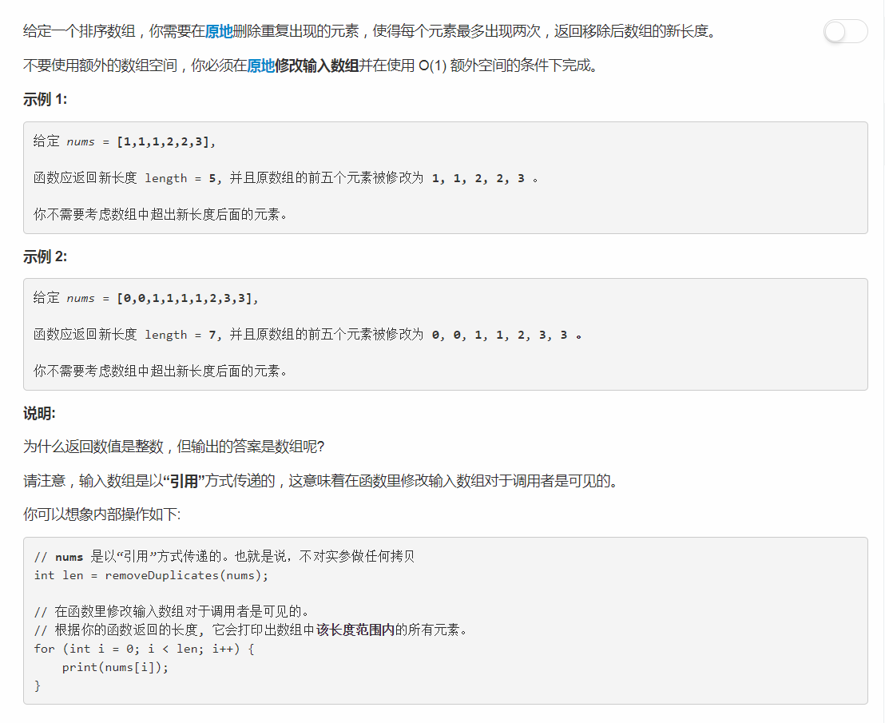

# 80 - 删除排序数组中的重复项

## 题目描述


>关联题目： [26. 删除排序数组中的重复项](https://github.com/Rosevil1874/LeetCode/tree/master/Python-Solution/80_Remove-Duplicates-from-Sorted-Array)


>审题：
1. 原地操作
2. 要注意返回的是数组的长度而不是数组

## 题解一
思路：
1. cnt: 记录相邻相同元素个数，初始化为0；
2. 从下标1开始，依次和前面的元素比较：
	- 若相同：
		- 若是第二个相同元素，不用删除，将cnt更新为2；
		- 若cnt > 2，则此元素前已经有两个相同元素，删除当前元素，并更新数组长度（减一）；
	- 若不相同，cnt重新赋值为1，下标后移一位。

```python
class Solution(object):
    def removeDuplicates(self, nums):
        """
        :type nums: List[int]
        :rtype: int
        """
        length = len(nums)
        i = 1
        cnt = 1
        while i < length:
        	if nums[i] == nums[i-1]:
        		if cnt == 1:
        			cnt = 2
        			i += 1
        		elif cnt == 2:
	        		del nums[i]
	        		length -= 1
        	else:
        		cnt = 1
        		i += 1
        # return nums
        return length
```

## 题解二
上大神代码了： [3-6 easy lines, C++, Java, Python, Ruby](https://leetcode.com/problems/remove-duplicates-from-sorted-array-ii/discuss/27976/3-6-easy-lines-C++-Java-Python-Ruby)  
思路就是把符合要求的留下，而不是删除不符合要求的。


```python
i = 0
for n in nums:
	if i < 2 or n > nums[i - 2]:
		nums[i] = n
		i += 1
return i
```