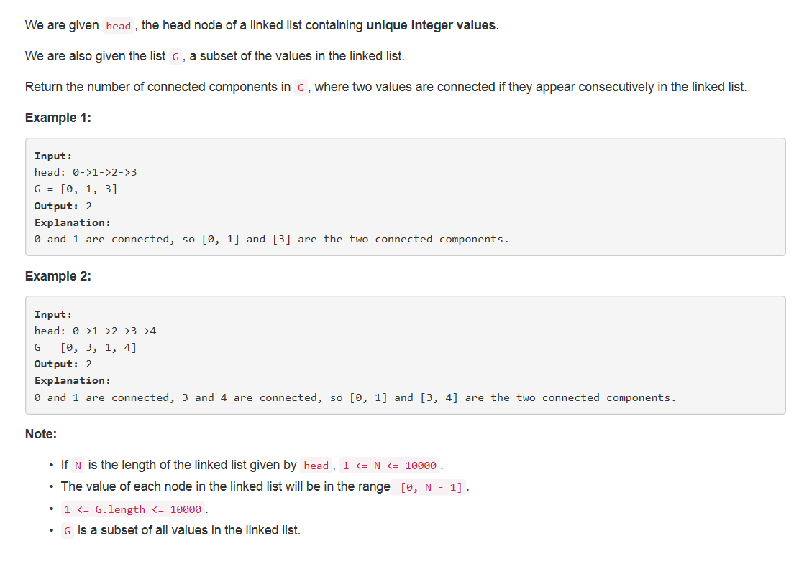
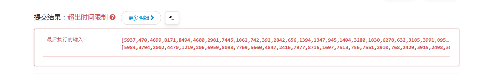

## 题目描述


<!-- more -->

>审题：
英文题干一定要好好审啊_(:з」∠)_ 
1. 给定一个元素不重复的链表头结点；
2. G是给定链表的子元素表；
3. 返回G中元素在原链表中相连的连接（连通分量）个数。

## 题解
思路：
1. 双指针prev和curr从头遍历链表；
2. 若两指针结点值均在G中则继续往后遍历；
3. 若prev结点值不在G中而curr结点值在G中说明此连通分量结束，下一连通分量开始，分量个数加一；
4. 直到遍历完链表。


```python
# Definition for singly-linked list.
# class ListNode(object):
#     def __init__(self, x):
#         self.val = x
#         self.next = None

class Solution(object):
    def numComponents(self, head, G):
        """
        :type head: ListNode
        :type G: List[int]
        :rtype: int
        """
        if not head:
			return 0
        
        G = set(G)
        dummy = ListNode(None)
        dummy.next = head
        prev = dummy
        curr = head
        num = 0
        while curr:
            num += prev.val not in G and curr.val in G
            prev = prev.next
            curr = curr.next
        return num
```

## debug
直接使用G会超时:

因为G是一个普通的list，list的in和not in操作是比较费时的。而set的in和not in是基于hash实现的，将其转换为set就不会超时了，G中元素本来就是互异的，将其转化成set也不会丢失数据。
`G = set(G)`

