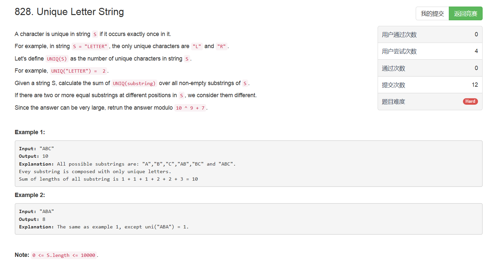

# 828. Unique Letter String

## 题目描述


>审题：  
1. 我们将UNIQ（S）定义为字符串S中的唯一字符数。例如，UNIQ（“LETTER”）= 2。 
2. 给定一个字符串S，计算S中所有非空子字符串的UNIQ（子字符串）的总和。
3. 如果在S中的不同位置有两个或更多个相同的子串，我们认为它们是不同的。
4. 由于答案可能非常大，请将结果求10 ^ 9 + 7的模。

## 题解
**参考了周赛排第一的大佬的答案，简直brilliant，果然优秀的程序员都是数学好的那部分**
思路：
1. 依次以每个字符作为中点，向左找到最远不重复的left，向右找到最远不重复的right；
2. 。。。不懂不懂

```python
class Solution(object):
    def uniqueLetterString(self, S):
        """
        :type S: str
        :rtype: int
        """
        ret = 0
        for i in range(len(S)):
            left = i - 1
            right = i + 1
            while left >= 0 and S[left] != S[i]:
                left -= 1
            while right < len(S) and S[right] != S[i]:
                right += 1
            ret += (right - i) * (i - left)
        return ret % (1000000007)
```
