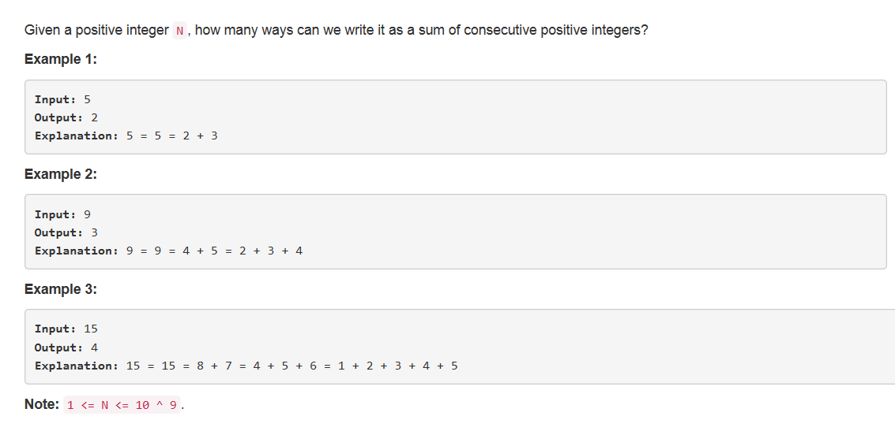

# 829. 连续正整数的和

## 题目描述


## 解法一【超时】
思路：
1. 依次以小于N//2+1的每个正整数为起点构造和为N的连续序列
	- 若成功则计数加一；
	- 否则以下一个数为起点构造。
2. 构造过程：在小于N的范围依次在起点的基础上往后加。
	- 若和为N则构造成功；
	- 若小于N则继续加；
	- 若大于N则构造失败。

```python
class Solution(object):
    def consecutiveNumbersSum(self, N):
        """
        :type N: int
        :rtype: int
        """
        # 加数一定小于N//2+1
        cnt = 1
        for i in range(1, N//2+1):
            ans = 0
            j = i
            while ans < N:
                ans += j
                j += 1
            if ans == N:
                cnt += 1
        return cnt
```


## 解法二【超时】
思路：
1. left表示序列最左的最小值，right表示序列最右的最大值；
2. 从最简单的1+2开始判断，即left=1，right=2，且时刻保证left < right（除本身以外，其他情况的连续正整数序列至少有两个元素）；
3. 计算序列和：
	- 若和为N则构造成功；
	- 只要和大于N就将序列最前面的最小值去掉，left++；
	- 若和小于N则在序列后再加一个大一点的数，right++；

```python
class Solution(object):
    def consecutiveNumbersSum(self, N):
        """
        :type N: int
        :rtype: int
        """

        cnt = 1             # N本身
        left = 1            # 加数中最小的一个
        right = 2           # 加数中最大的一个
        s = left + right

        # 除本身以外加数一定小于等于N//2+1
        while left < N//2+1:
            if s == N:
                print(left,right)
                cnt += 1
                
            # 若连续正整数和大于N，就一个个删左边最小的数
            while s > N:
                s -= left
                left += 1
                if s == N and left < right:
                    print(left,right)
                    cnt += 1

            # 若连续正整数和小于N，就一个个往右边加一个数
            right += 1
            s += right
                
        return cnt
```

## 解法三
>**大神都是用数学的啊同学 ！！！**

思路：  
一个数N若可以写成以a开头的连续n个自然数之和，  
则满足`N = a+(a+1)+(a+2)+…+(a+n-1) = n*a+n*(n-1)/2`，
且`a!=0` ,则 `n*a = N - n*(n-1)/2) != 0`，
则`(N - n*(n-1)/2) % n == 0`。
**所以一个数N可以写成以a开头的连续n个自然数之和的条件是：`(N - n*(n-1)/2) % n == 0`且`a != 0`**  

遍历n = 2…sqrt(N)\*2，若N可以表示为n个连续正整数和则计数加一。

```python
class Solution(object):
    def consecutiveNumbersSum(self, N):
        """
        :type N: int
        :rtype: int
        """
        cnt = 1
        i = 2
        while (i/2)*(i/2) <= N:
            if (N - i * (i - 1) // 2) % i == 0:
                a = (N - i * (i - 1) // 2) / i
                if a > 0:
                    cnt += 1
            i += 1
        return cnt
```