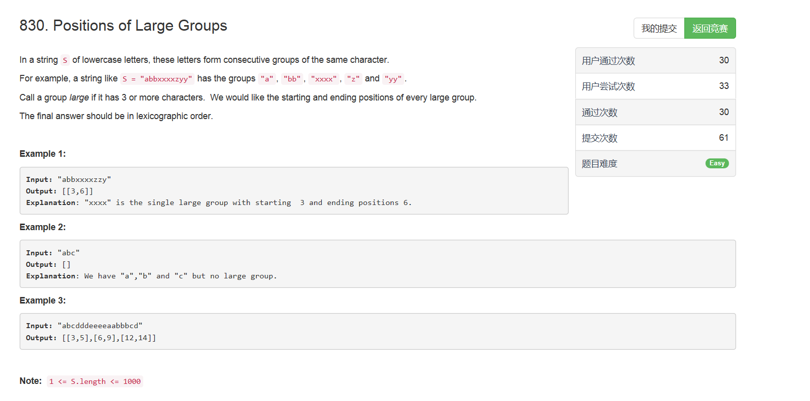

# 830. Positions of Large Groups

## 题目描述


>审题：  
给定一个字符串，返回连续相同元素大于等于3个的子序列的起止下标。

## 题解
思路：  
其实就是一个字符串处理，照着题意中的要求一条一条改就行了，情况不多挺好判断的。

```python
class Solution(object):
    def largeGroupPositions(self, S):
        """
        :type S: str
        :rtype: List[List[int]]
        """
        res = []
        i = 0
        while i < len(S):
            j = i
            while j < len(S) and S[i] == S[j]:
                j += 1
            if j - i >= 3:
                res.append([i, j - 1])
                i = j
            else:
                i += 1
        return res
```