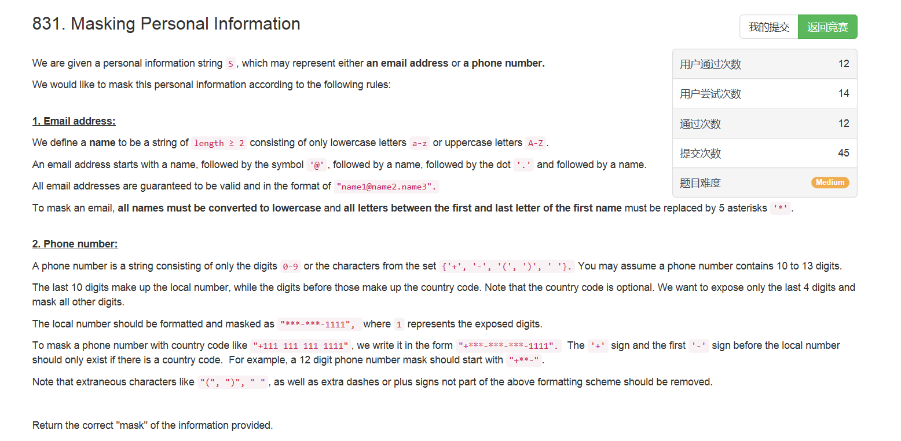
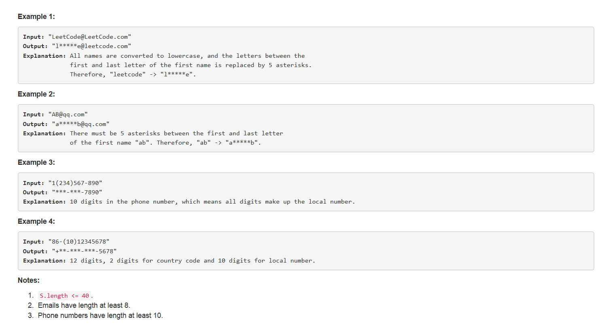

# 831. Masking Personal Information

## 题目描述



>审题：  
这个题目可以说是宇宙超级无敌长了，英语不好的我挣扎着看完了题目，大意就是给你一个字符串，这个字符串可能是email地址，也可能是电话号码。为了保护私人信息，我们需要在这些字符串上“做点手脚”，让别人看不出来本来是啥。
- email：
    - 所有字符转化成小写；
    - @符号前的子串，无论多长都转化成“第一个字符+5个*+最后一个字符”
- 电话号码：
    - 去除不必要的特殊字符：{'+', '-', '(', ')', ' '}.；
    - 只保留最后四位为原来的数字，其他数字都变成*；
    - 只有超过10位的才有"+***-***-***-1111"前面的“+***-”部分。

## 题解
思路：  
其实就是一个字符串处理，照着题意中的要求一条一条改就行了，情况不多挺好判断的。

```python
class Solution(object):
    def maskPII(self, S):
        """
        :type S: str
        :rtype: str
        """
        # 1. 首先判断是email还是phone
        if '@' in S:
            return self.maskEmail(S)
        else:
            return self.maskPhone(S)

    def maskEmail(self, S):
        # 1. 将所有字母转化成小写
        S = S.lower()

        # 2. mask name1
        idx = S.find('@')
        S = S[0] + '*****' + S[idx - 1 : ]

        return S

    def maskPhone(self, S):
        # 1. 去除特殊符号
        delete = '+-() '
        for c in delete:
            S = S.replace(c,'')
        
        # 2. 除最后四位以外都转化成‘*’
        if len(S) == 10:
            S = '***-***-' + S[-4:]
        else:
            S = '+' + '*' * (len(S) - 10) + '-***-***-' + S[-4:]

        return S
```