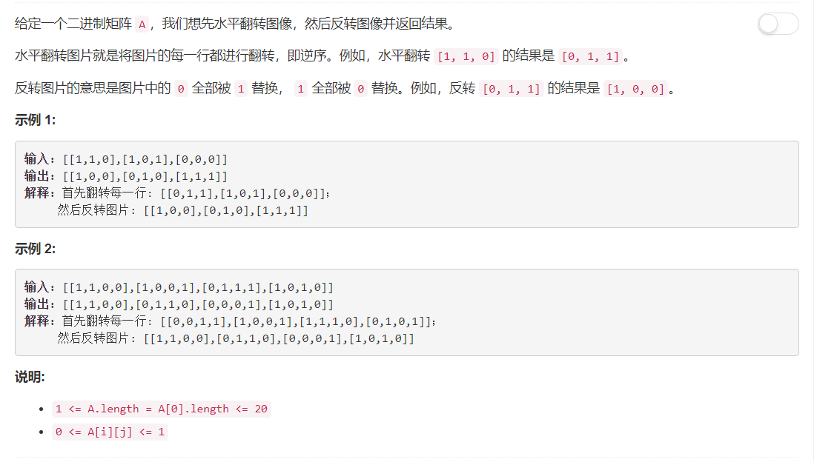

# 832. 反转图像

## 题目描述



## 题解一
**思路：**  
这题的思路相当于没有思路，跟着题目意思走就行，先将矩阵逐行反转，每一行在翻转后都一一进行反转，0、1反转的方法是与1进行异或。    
这样简单的思路最担心的就是超时，提交的时候提交结果一直转啊转啊转，我心想完了，转了这么半天还能不超时咋滴？结果！通过了嘿嘿，开心开心❤  


```python
class Solution:
    def flipAndInvertImage(self, A):
        """
        :type A: List[List[int]]
        :rtype: List[List[int]]
        """
        for row in A:
        	row.reverse()
        	for i in range(len(row)):
        		row[i] = row[i] ^ 1
        return A
```


## 题解二  
照例需要看看大神的代码陶冶一下情操，瞟了一眼发现只有一行，嗯的确是python style。然后自己写了一下，也没有什么难度嘛，为什么自己想不到呢榆木脑袋哎😔  
这个提交比第一个快三分之一，应该是在于翻转操作一个使用函数reverse一个使用切片吧，切片比reverse快呀。

```python
class Solution:
    def flipAndInvertImage(self, A):
        """
        :type A: List[List[int]]
        :rtype: List[List[int]]
        """
        return [[x ^ 1 for x in row[::-1]] for row in A]
```