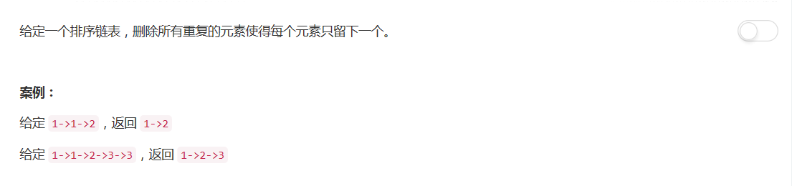

# 83 - 删除排序链表中的重复元素
## 题目描述


>关联题目： [82. 从分类列表中删除重复项目 II](https://github.com/Rosevil1874/LeetCode/tree/master/Python-Solution/82_Remove-Duplicates-from-Sorted-List-II)

>审题：
82题是此题变种，觉得82题要考虑的多一点，先写这题再写前面那题，方法都是一样的。

## 双指针
1. 指针1指向不重复的最后一个结点；
2. 指针2依次扫描，若不重复则更新指针1，否则移除。

```python
# Definition for singly-linked list.
class ListNode:
    def __init__(self, x):
        self.val = x
        self.next = None

class Solution:
    def deleteDuplicates(self, head):
        """
        :type head: ListNode
        :rtype: ListNode
        """

        if head is None or head.next is None:
            return head

        tail = head   # 最后一个不重复的结点
        p = head.next
        while p is not None:
            if tail.val == p.val:
                p = p.next
                tail.next = tail.next.next
            else:
                p = p.next
                tail = tail.next
        return head
```