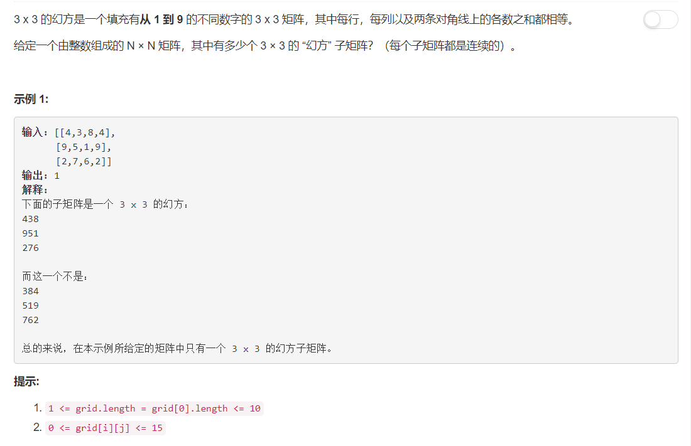

# 840 - 矩阵中的幻方

## 题目描述



## 简单暴力
1. 若矩阵规模小于3*3，结果为0；
2. 对大的矩阵，遍历每一个3*3的矩阵；
	- 若矩阵中有非0~9的数字，不满足条件；
	- 分别计算每一行、每一列、两条对角线的元素和；
	- 若上述和均相等则满足条件，否则不满足.
```python
import itertools
class Solution:
    def numMagicSquaresInside(self, grid):
        """
        :type grid: List[List[int]]
        :rtype: int
        """
        cnt = 0
        height, width = len(grid), len(grid[0])
        if height < 3 or width < 3:
            return 0


        for i in range(height - 2):
            for j in range(width - 2):
                matrix = [ row[ j : j + 3] for row in grid[ i : i + 3]]
                if any(x < 1 or x > 9 for x in itertools.chain(*matrix)):
                    continue

                # 计算3*3矩阵中每一行的和
                rows = { sum( matrix[i] ) for i in range(3) }

                # 计算3*3矩阵中每一列的和
                T = list( itertools.zip_longest(*matrix) )
                cols = { sum( T[i] ) for i in range(3) }

                # 计算3*3矩阵两条对角线的和
                diagonal1 = { sum(matrix[i][i] for i in range(3)) }
                diagonal2 = { sum(matrix[~i][~i] for i in range(3)) }

                # 判断以上计算的三种和是否相等
                if len( rows | cols | diagonal1 | diagonal2 ) == 1:
                    cnt += 1

        return cnt
```
