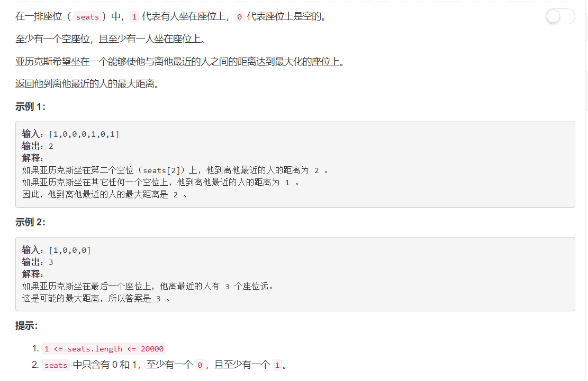

# 849 - 到最近的人的最大距离

## 题目描述



## 方法
**计算** 
1. 计算最左端连续0子序列长度；
2. 计算最右端连续0子序列长度；
3. 计算中间部分最长连续0长度。

**判断**    
返回两端子序列长度，(中间最长0序列长度 + 1) / 2，这三个值中最大的一个；
```python
import math
class Solution:
    def maxDistToClosest(self, seats):
        """
        :type seats: List[int]
        :rtype: int
        """
        n = len(seats)
        cnt, cntLeft, cntMid, cntRight = 0, 0, 0, 0

        # 最左端连续0子序列长度
        i = 0
        if seats[0] == 0:
            while i < n:
                if seats[i] == 0:
                    cntLeft += 1        
                else:
                    break
                i += 1
        res = cntLeft

        # 最右端连续0子序列长度
        j = n - 1
        if seats[n - 1] == 0:
            while j > 0:
                if seats[j] == 0:
                    cntRight += 1        
                else:
                    break
                j -= 1
        res = max(res, cntRight)

        # 中间连续0子序列长度
        while i < j:
            if seats[i] == 0:
                cnt += 1
            else:
                cntMid = max(cntMid, cnt)
                cnt = 0
            i += 1
        cntMid = max(cntMid, cnt)

        res = max(res, math.floor((cntMid + 1) / 2))
        return res
```
