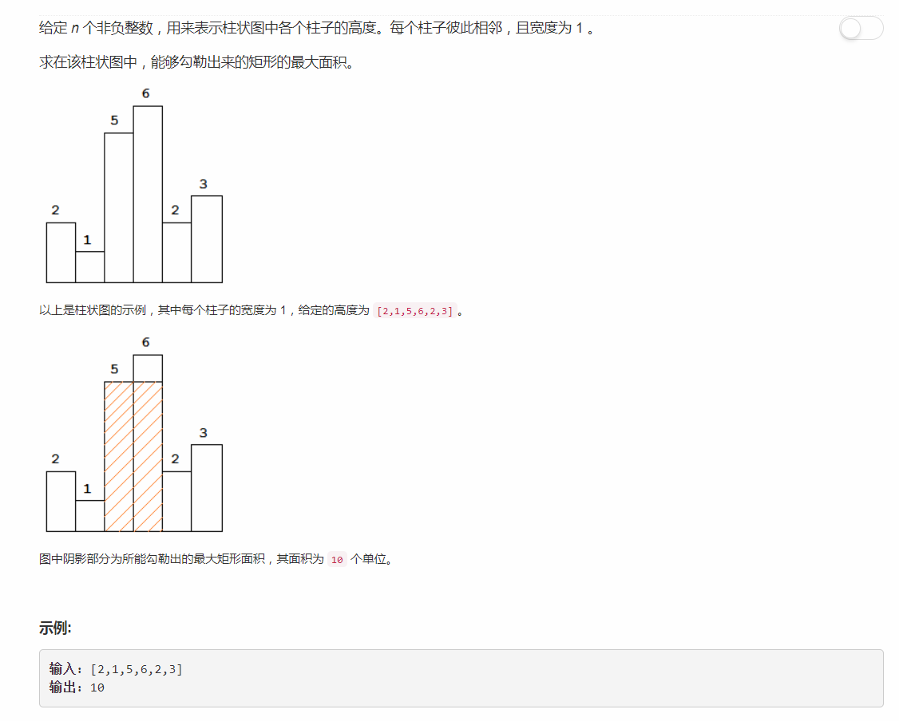

# 84 - 删除排序链表中的重复元素
## 题目描述


>关联题目： [85.  最大矩形](https://github.com/Rosevil1874/LeetCode/tree/master/Python-Solution/85_Maximal-Rectangle)

## 栈
思路：  
1. 在heights数组后加上一个高度为0的哨兵，以正确计算最后一个柱子；
2. 栈中存放一组高度值比当前元素高的柱子的下标；
3. 遍历数组：
    - 若当前柱子比栈顶（当前阶段最高的柱子）的高度低，说明当前元素无法和栈中保存的柱子们构成一个面积较大的矩形（强行加载一起的话当前柱子就成了木桶效应中的短板，面积反而会减小）。此时将栈中比当前柱子高的都弹出并计算面积，更新最大面积。
    - 否则说明此柱子并非短板，加上它可能增加当前正在构建的矩形的面积，直接将其下标压栈。
```python
class Solution(object):
    def largestRectangleArea(self, heights):
        """
        :type heights: List[int]
        :rtype: int
        """
        heights.append(0)   # 哨兵
        stack = [-1]
        maxReact = 0
        for i in range(len(heights)):
            while heights[i] < heights[stack[-1]]:
                h = heights[stack.pop()]
                w = i - stack[-1] - 1
                maxReact = max(maxReact, h *w)
            stack.append(i)
        return maxReact
```