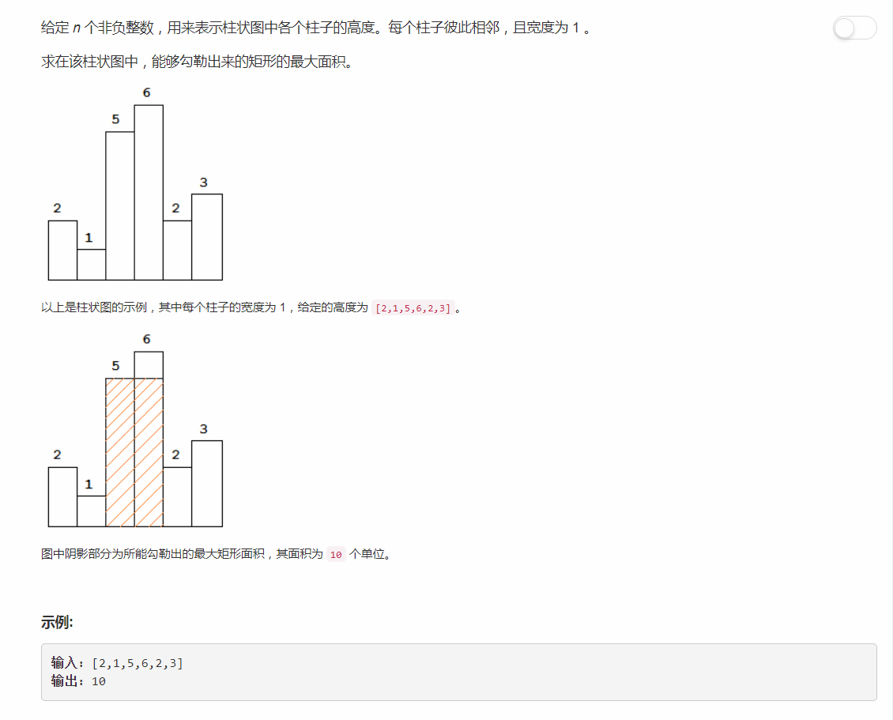

# 84 - 柱状图中最大的矩形
## 题目描述



## 解法一
此题是以前刷CCF的时候就遇到过得，所以看到它的第一反应就是用曾经的方法试一下，虽然非常有可能超时。  
思路： 遍历数组，分别以每个柱子为中心向两边开拓，同时更新最大面积.

```python
class Solution(object):
    def largestRectangleArea(self, heights):
        """
        :type heights: List[int]
        :rtype: int
        """
        maxReact = 0
        for i in range(len(heights)):
        	j = i - 1
        	k = i + 1
        	width = 1
        	while j >= 0 and heights[j] >= heights[i]:
        		width += 1
        		j -= 1
        	while k < len(heights) and heights[k] >= heights[i]:
        		width += 1
        		k += 1
        	maxReact = max(maxReact, heights[i] * width)
        return maxReact
```

果然，timeout(T ^ T) 

## 解法二

> 其实看相关话题的时候就有看到栈，知识思维被以前的解题思路禁锢住了，一时想不到该怎么使用栈来解决，So，，，参考大神的解法。  
cr: [AC Python clean solution using stack 76ms](https://leetcode.com/problems/largest-rectangle-in-histogram/discuss/28917/AC-Python-clean-solution-using-stack-76ms)

思路：
1. 在高度数组的末尾添加一个高度值为0的哨兵结点，以方便计算最后一个元素所在最大矩形面积；
2. 使用栈保存遍历到的元素按栈底到栈顶高度升序排列的下标；
3. 从头遍历每个元素：
	- 若其高度小于当前栈顶下标表示的高度（前面连续矩形中的最大高度），说明从当前元素开始和前面的连续矩形断开了，即前面压栈的柱子无法往右边延伸。此时栈顶元素出栈计算面积并更新面积。
	- 若其高度大于等于当前栈顶下标表示的高度，说明此柱子还能和前面的柱子连成一片，将其压栈。

>原谅我的解释太绕，自己都不知道在说些什么，结合图片就能看明白了，还不明白就看看大神的解释(T ^ T) 

```python
class Solution(object):
    def largestRectangleArea(self, heights):
        """
        :type heights: List[int]
        :rtype: int
        """
        heights.append(0)	# 哨兵
        stack = [-1]
        maxReact = 0
        for i in range(len(heights)):
        	while heights[i] < heights[stack[-1]]:
        		h = heights[stack.pop()]
        		w = i - stack[-1] - 1
        		maxReact = max(maxReact, h *w)
        	stack.append(i)
        return maxReact
```