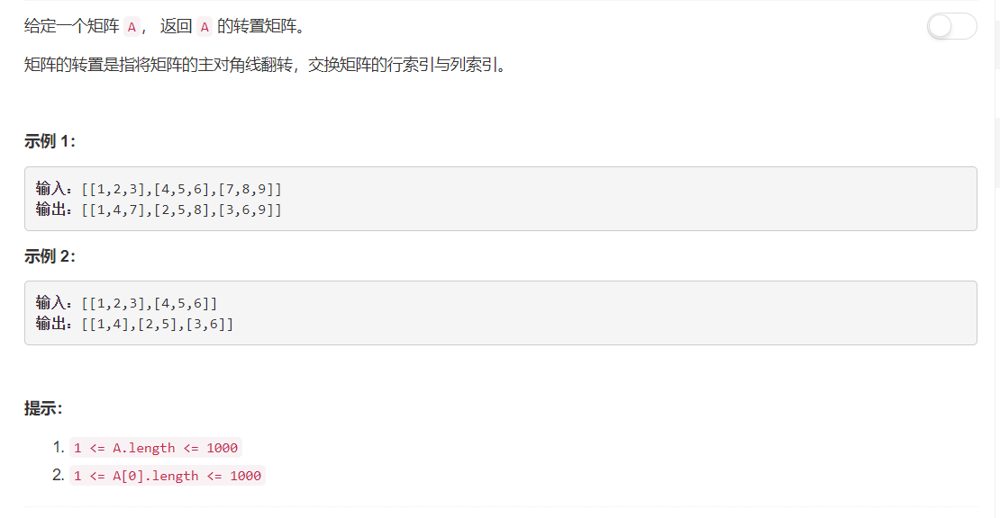

# 867 - 转置矩阵

## 题目描述



## 方法
emmm就行列索引交换啊╮(╯▽╰)╭
```python
class Solution:
    def transpose(self, A):
        """
        :type A: List[List[int]]
        :rtype: List[List[int]]
        """
        row = len(A)
        col = len(A[0])
        res = [[0] * row for i in range(col)]
        
        for i in range(row):
            for j in range(col):
                res[j][i] = A[i][j]
        return res
```
