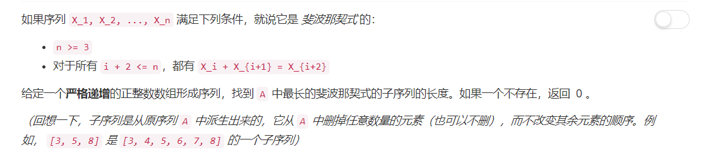
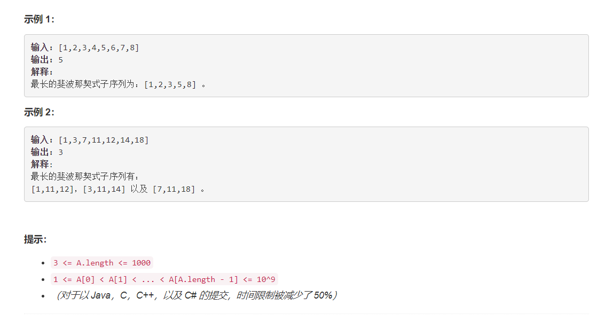

# 873 - 最长的斐波那契子序列的长度

## 题目描述




## 题解一
**思路：**    
1. 将数组中的元素放到set中，目的不是为了去重，而是在set中的查找速度比较快；
2. 返回值初始化为2，就是只有两个元素的情况，此时只是默认这有两个元素是属于斐波那契数列的，若最后没有符合条件的数列则返回0.
3. 分别以每两个元素作为初始元素，向后找属于这一斐波那契数列的元素并更新长度；
4. 返回找到的最长的长度。

>参考：[[C++/Java/Python] Check Pair](https://leetcode.com/problems/length-of-longest-fibonacci-subsequence/discuss/152343/C++JavaPython-Check-Pair)

```python
class Solution:
    def lenLongestFibSubseq(self, A):
        """
        :type A: List[int]
        :rtype: int
        """
        s = set(A)
        res = 2
        for i in range(len(A)):
        	for j in range(i + 1, len(A)):
        		a, b, length = A[i], A[j], 2
        		while (a + b) in s:
        			a, b, length = b, a + b, length + 1
        		res = max(res, length)
        return res if res > 2 else 0
```

思路是简洁且正确的，然鹅。。。超时了哇


## 题解二
**思路：**    
动态规划Dynamic Programming ~   好久没接触到的名字了，我的coding能力真是越来越瞎了😔  
同样的，参考了上面那位同学，emmmm不过溜了一圈，用动态规划的都是这样标识的。

>dp[a, b] represents the length of fibo sequence ends up with (a, b)
Then we have dp[a, b] = dp[b - a, a] or 2
The complexity reduce to O(N^2).
In Python, I use value as key.

```python
import collections
class Solution:
    def lenLongestFibSubseq(self, A):
        """
        :type A: List[int]
        :rtype: int
        """
        dp = collections.defaultdict(int)
        s = set(A)
        res = 0
        for j in range(len(A)):
        	for i in range(j):
        		a, b = A[i], A[j]
        		if b - a < a and b - a in s:
        			dp[a, b] = dp.get((b - a, a), 2) + 1
        			res = max(res, dp[a, b])
        return max(dp.values() or [0])
```