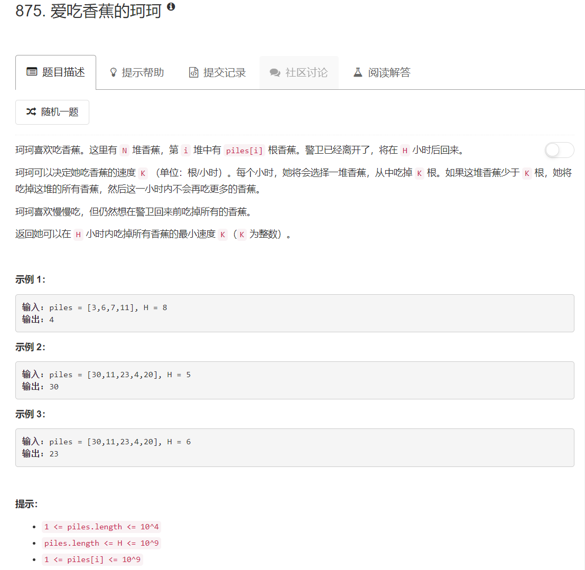

# 875 - 爱吃香蕉的珂珂

## 题目描述


>相似题目：  
[1011.在 D 天内送达包裹的能力](https://github.com/Rosevil1874/LeetCode/tree/master/Python-Solution/1011_Capacity_To_Ship_Packages_Within_D_Days)


## 题解 【二分查找】
**思路：**    
1. 隐藏条件N <= H, 不然珂珂每小时吃完一堆也不行；
2. 速度K最小为1，最大为最大堆的香蕉个数；
3. 在速度的可行范围内二分查找：
    - 所当前速度所需时间大于H，提高速度；
    - 否则降低速度，直到找到最小的符合条件的速度K。

```python
import math
class Solution(object):
    def minEatingSpeed(self, piles, H):
        """
        :type piles: List[int]
        :type H: int
        :rtype: int
        """
        left, right = 1, max(piles)
        while left < right:
            mid = (left + right) // 2
            # need = sum( math.ceil(x / mid) for x in piles )  我不知道为什么用ceil就是错的，哭唧唧~
            need = sum( ((x + mid - 1) / mid) for x in piles )
            if need > H:
                left = mid + 1
            else:
                right = mid
        return left
```
