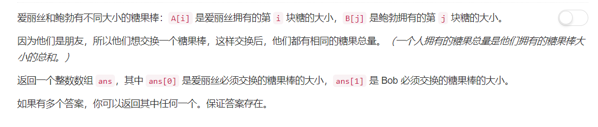
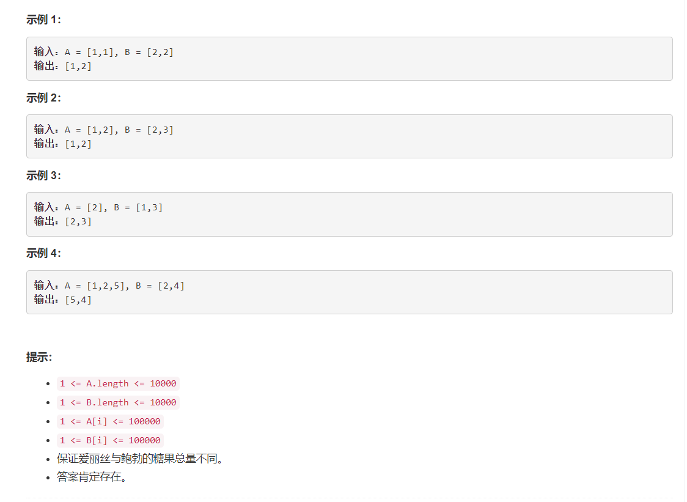

# 888 - 公平的糖果交换

## 题目描述




## 题解一
**思路：**  
1. 先计算爱丽丝和鲍勃各自的糖果总量，并计算相差为diff；
2. 找到分别位于两数组中的差距为diff/2的元素对，将其交换。
    - 若爱丽丝较多，就将爱丽丝中大的与鲍勃中比其小diff/2的糖果交换；
    - 若鲍勃较多，就将鲍勃中大的与爱丽丝中比其小diff/2的糖果交换；
    - PS. 因为交换之后总量的变化是局部的两倍所以要除以2

然鹅，超时了哭唧唧😥

```python
class Solution:
    def fairCandySwap(self, A, B):
        """
        :type A: List[int]
        :type B: List[int]
        :rtype: List[int]
        """
        sum_a, sum_b = sum(A), sum(B)
        len_a, len_b = len(A), len(B)
        diff = sum_a - sum_b

        if len_a <= len_b:
            for x in A:
                target = x - int(diff/2)
                if target in B:
                    return ([x, target])
        else:
            for x in B:
                target = x + int(diff/2)
                if target in A:
                    return ([target, x])
```


## 题解二
**思路：**  
思路是一样的啊喂，但是人家代码就是优雅，人家时间复杂度就是低，人家就是厉害。   
更加哭唧唧😭  
主要改进就是用set去重，大大提高了检索效率，而我只能想到蠢蠢的判断哪个list比较短，用短的list为基准来遍历会快那么一丢丢吧，哎哟我这可怜的脑子诶。。。

>reference: [[C++/Java/Python] Straight Forward](https://leetcode.com/problems/fair-candy-swap/discuss/161269/C++JavaPython-Straight-Forward)

```python
class Solution:
    def fairCandySwap(self, A, B):
        """
        :type A: List[int]
        :type B: List[int]
        :rtype: List[int]
        """
        diff = int( (sum(A) - sum(B))/2 )
        set_b = set(B)
        for x in set(A):
            target = x - diff
            if target in set_b:
                return ([x, target])
```