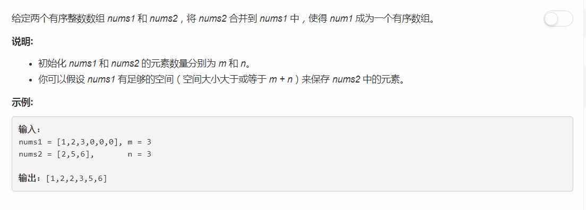

# 88 - 合并两个有序数组
## 题目描述



## 解法一
3行代码，little trick哈哈，就是把nums2中的元素加到nums1后面再排个序。  
虽然知道这不是出题者的本意还是忍不住走了捷径。

```python
class Solution(object):
    def merge(self, nums1, m, nums2, n):
        """
        :type nums1: List[int]
        :type m: int
        :type nums2: List[int]
        :type n: int
        :rtype: void Do not return anything, modify nums1 in-place instead.
        """
        for i in range(m, m + n):
            nums1[i] = nums2[i - m]
        nums1.sort()
```

## 解法二
思路：  
1. 从前往后比较两数组中的元素：
    - 若nums2中元素比nums1中当前元素小，先删除nums1中最后一个元素（防止空间溢出），再将nums2中当前元素插入到nums1当前元素之前；
    - 否则继续在nums1向后检查；
2. 若最后nums2中还有元素未插入nums1中，剩下的一定都比nums1中已放好的元素大，只需依次放进去就行。

```python
class Solution:
    def merge(self, nums1: List[int], m: int, nums2: List[int], n: int) -> None:
        """
        Do not return anything, modify nums1 in-place instead.
        """
        i, j = 0, 0
        while i < len(nums1) and j < n:
            if nums1[i] > nums2[j]:
                nums1.pop()
                nums1.insert(i, nums2[j])
                j += 1
            i += 1
            
        while j < n:
            nums1[m + j] = nums2[j]
            j += 1
```

## 解法三
思路：  
1. 由于两个数组都按升序排列，因此从后往前比较两个数组中的元素，将其中较大的一个插入nums1的末尾；
2. 若最后nums2中还有元素未插入nums1中，剩下的一定都比nums1中已放好的元素小，只需依次放进去就行。


```python
class Solution:
    def merge(self, nums1: List[int], m: int, nums2: List[int], n: int) -> None:
        """
        Do not return anything, modify nums1 in-place instead.
        """
        i, j, k = m - 1, n - 1, m + n - 1
        while i>= 0 and j >= 0:
            if nums1[i] >= nums2[j]:
                nums1[k] = nums1[i]
                i -= 1
            else:
                nums1[k] = nums2[j]
                j -= 1
            k -= 1
        
        while j >= 0:
            nums1[k] = nums2[j]
            j -= 1
            k -= 1
```