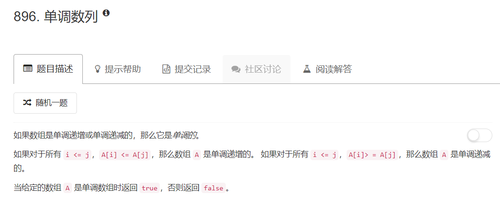

# 896 - 单调数列

## 题目描述



## 题解一：用轮子
**思路：**  
1. 对数组排序
2. 原数组与有序数组比较，若相同或相反则说明原数组单调，否则不单调。  
beat 73%，比我想得要快。
```python
import operator
class Solution:
    def isMonotonic(self, A):
        """
        :type A: List[int]
        :rtype: bool
        """
        inc = sorted(A)
        # print(inc, inc[::-1])
        if operator.eq(A, inc) or operator.eq(A, inc[::-1]):
        	return True
        else:
        	return False
```

## 题解二：造轮子
**思路：**  
就是不听判断情况：  
1. 只有一个元素，true；
2. 所有元素相同，true；
3. 按头两个不同元素的大小情况检查后面的元素，前面递增则后面依次递增，前面递减则后面依次递减。一旦出现一个顺序不同的情况即返回false，若检查完整个序列其增减情况均相同则返回true。

beat 79%，比上面快一点点。
```python 
class Solution:
    def isMonotonic(self, A):
        """
        :type A: List[int]
        :rtype: bool
        """
        length = len(A)
        if length < 2:
        	return True

        for i in range(length - 1):
        	sign = A[i] - A[i + 1]
        	if sign != 0:
        		break

        if i == length - 2:
        	return True
        elif sign > 0:
        	for j in range(i, length - 1):
        		if A[j] - A[j + 1] < 0:
        			return False
        	return True
        else:
        	for j in range(i, length - 1):
        		if A[j] - A[j + 1] > 0:
        			return False
        	return True
```