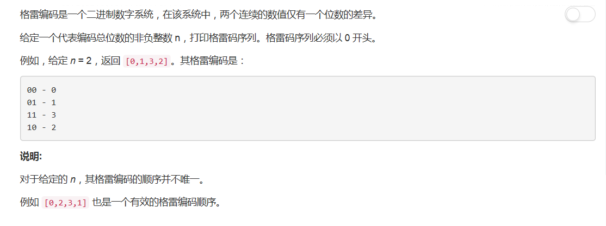
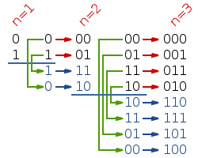
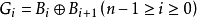

# 89 - 格雷码

## 题目描述


## 题解一
思路：  
>找呀找呀找规律。。啾啾啾(｡◕ˇ∀ˇ◕)

如上图所示，3位格雷码是在2位格雷码的基础上加上最高位为0的情况，和最高位为1且反序的情况，同理，2位格雷码可由1位的构造。


```python
class Solution(object):
    def grayCode(self, n):
        """
        :type n: int
        :rtype: List[int]
        """
        ret = [0]
        for i in range(n):
            j = len(ret) - 1
            while j >= 0:
                ret.append(ret[j] | 1 << i)
                j -= 1
        return ret
```

## 题解二
cr: [An accepted three line solution in JAVA](https://leetcode.com/problems/gray-code/discuss/29881/An-accepted-three-line-solution-in-JAVA)  
万万没想到格雷码还有公式（这句话写出来会不会很丢人，这会不会是大家都知道的_(°ω°｣∠)_

>The idea is simple: `G(i) = i^ (i/2)`

果然，百科爸爸也说了：

我好像忽然想起来。。。数字逻辑学过这个公式，邝爷爷请不要打我ε=ε=ε=ε=ε=(/~0~)/

```python
class Solution(object):
    def grayCode(self, n):
        """
        :type n: int
        :rtype: List[int]
        """
        ret = []
        for i in range(2 ** n):
            ret.append(i ^ i >> 1)
        return ret
```