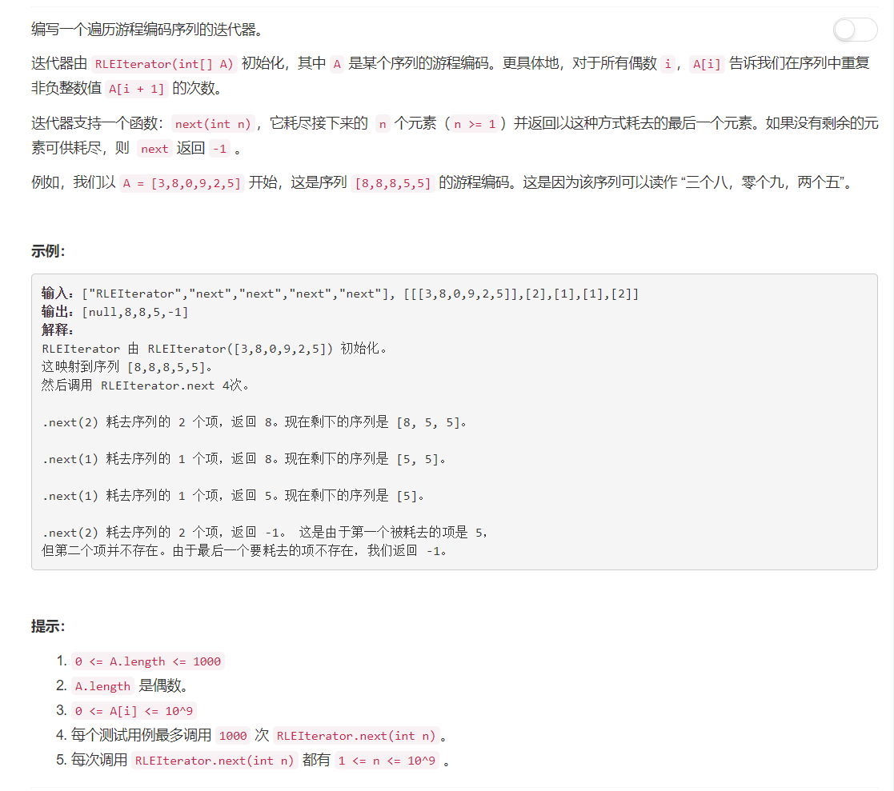

# 900 - RLE迭代器

## 题目描述



## 题解一
**思路：**  
这是我知道的最简单的，一定可行的，也一定会超时的方法。  
也就是通过游程编码构造出原序列，直接在原序列上进行操作。

>代码暂且放上，确实是超时了。
```python
class RLEIterator:

    def __init__(self, A):
        """
        :type A: List[int]
        """
        self.list = []
        i = 0
        while i < len(A) - 1:
            self.list += [A[i + 1] for j in range(A[i])]
            i += 2
        print(self.list)

    def next(self, n):
        """
        :type n: int
        :rtype: int
        """
        if n <= len(self.list):
            res = self.list[n - 1]
            self.list = self.list[n:]
        else:
            res = -1
            self.list = []
        
        return res
```


## 题解二
**思路：**  
这个更直接好不好，为什么还要去还原序列我个蠢货。。。

```python
class RLEIterator:

    def __init__(self, A):
        """
        :type A: List[int]
        """
        self.A = A
        self.idx = 0

    def next(self, n):
        """
        :type n: int
        :rtype: int
        """
        while self.idx < len(self.A) and n > self.A[self.idx]:
            n -= self.A[self.idx]
            self.idx += 2

        if self.idx >= len(self.A):
            return -1

        self.A[self.idx] -= n
        return self.A[self.idx + 1]
```