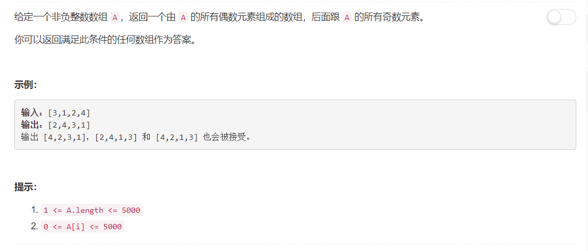

# 905 - 按奇偶排序数组

## 题目描述



## 题解一
**思路：**    
emmmm...就是很傻的遍历方法，遇到偶数就添加到返回数组的头部，遇到奇数就添加到返回数组的尾部。  
我还以为会超时，结果AC了哈哈，但是很慢啊 beat 9.80%。

```python
class Solution:
    def sortArrayByParity(self, A):
        """
        :type A: List[int]
        :rtype: List[int]
        """
        res = []
        for x in A:
        	if x % 2 == 0:
        		res.insert(0, x)
        	else:
        		res.insert(len(res) , x)
        return res
```

## 题解二
**思路：**  
再来一个inplace的方法, beat 76.95%。就是双指针初始指向头尾：  
1. 若左边是奇数右边是偶数就交换两个数；
2. 若只有左边是偶数（满足条件）就左边指针右移一位；
3. 若只有右边是奇数（满足条件）就右边指针左移一位；
4. 若已经满足左边偶数右边奇数则两指针同时向中间移动一位。
>reference:[Python 2 pointer in place swap, beats 99%](https://leetcode.com/problems/sort-array-by-parity/discuss/171606/Python-2-pointer-in-place-swap-beats-99)
```python
class Solution:
    def sortArrayByParity(self, A):
        """
        :type A: List[int]
        :rtype: List[int]
        """
        i, j = 0, len(A) - 1
        while i < j:
            left, right = A[i], A[j]
            if left % 2 == 1 and right % 2 == 0:
                A[i], A[j] = right, left
            elif left % 2 == 0:
                i += 1
            elif right % 2 == 1:
                j -= 1
            else:
                i += 1
                j -= 1
        return A
```

此外还有一个自己想不出来哪里出了问题的思路：从前往后遍历，遇到奇数不管，遇到偶数将其删除后插到第一个位置。要是哪位小天使知道为什么求告知，可直接发GitHub上留的邮箱⭐
```python 
class Solution:
    def sortArrayByParity(self, A):
        """
        :type A: List[int]
        :rtype: List[int]
        """
        for x in A:
            if x % 2 == 0:
                A.remove(x)
                A.insert(0, x)
        return A
```

## 题解三
有个超简单的思路，但不是很快，beat 23.84%。  
就是按list中每个数对2的模排序，模为0的偶数自然排在模为1的奇数前面了啊。  
>reference:[really simply python](https://leetcode.com/problems/sort-array-by-parity/discuss/183575/really-simply-python)
```python

```