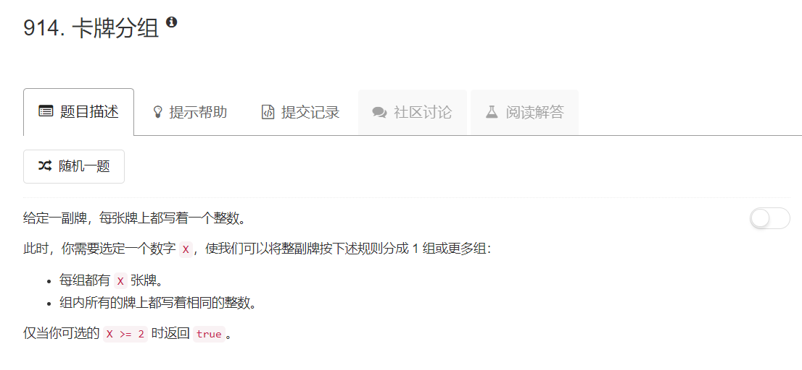
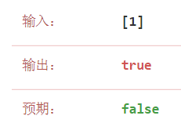
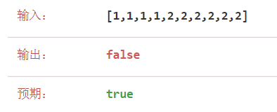

# 914 - 卡牌数组

## 题目描述



## 题解一【行不通哒】
这道题的思路可以说是非常简单了，只要求得每个数字分别出现的次数，找出最小的次数，若别的都是最小次数的整数倍则有可行分组，否则没有。
（打脸ing）
```python
from collections import Counter
class Solution:
    def hasGroupsSizeX(self, deck):
        """
        :type deck: List[int]
        :rtype: bool
        """
        cnt = Counter(deck).values()
        min_cnt = min( cnt )
        for x in cnt:
        	if x % min_cnt != 0:
        		return False
        return True
```

当我甚至题目中的用例也只测了两个，抱着必胜的信心毫不犹豫提交的时候。。。果然，被error暴打，原因在于：
1. 上面的解法没有考虑只有一个元素的情况，看来粗心是从娘胎带来的了，从小到大都被老师说“这娃聪明还是聪明，就是粗心大意啊”，哎。


2. 应该求最大公约数而不是直接对min_count取模吧。


## 题解二
嗯是的，吸取了前面的教训，我们来愉快地求每个数字出现的最大公约数吧。
若最大公约数 >= 2, 则存在可行分组，否则不存在。
```python
from collections import Counter
from functools import reduce
class Solution:
    def hasGroupsSizeX(self, deck):
        """
        :type deck: List[int]
        :rtype: bool
        """
        def gcd(a, b):
        	while b:
        		a, b = b, a%b
        	return a

        cnt = Counter(deck).values()
        return reduce(gcd, cnt) >= 2
```