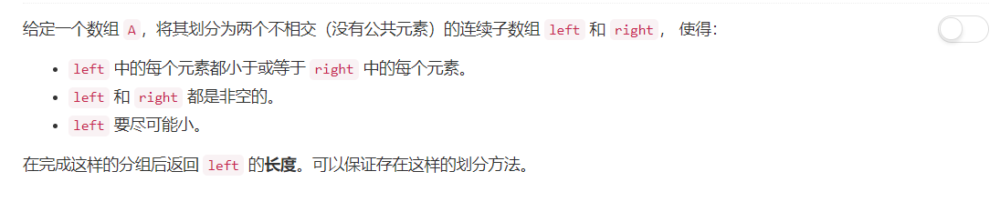
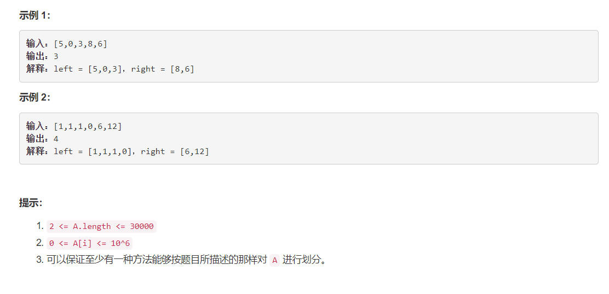

# 915 - 分割数组

## 题目描述




## 题解
**思路：**  
1. 3个变量
    - left_max = A[0]，代表partition元素左边最大值；
    - all_max = left_max，代表目前遍历的所有元素中的最大值；
    - partition_index = 0，代表分割位置；
2. 从A[1]开始遍历数组：
    - 若left_max <= A[i]，说明A[i]是目前为止遍历到的最大值，更新all_max为A[i]；
    - 反之，若left_max > A[i]，假定i为分割点，更新left_max；
3. 遍历过程中，一旦找到真正的partition之后，left_max不再更新，因为后面的A[i]都将比left_max大。因此left_max为partition左边最大值，all_max为全局最大值，是一直更新的。

>参考：[Java, one pass, 7 lines](https://leetcode.com/problems/partition-array-into-disjoint-intervals/discuss/175945/Java-one-pass-7-lines)

```python
class Solution:
    def partitionDisjoint(self, A):
        """
        :type A: List[int]
        :rtype: int
        """
        left_max = A[0]
        all_max = left_max
        partition_index = 0
        for i in range(1, len(A)):
            if left_max <= A[i]:
                all_max = max( all_max, A[i] )
            else:
                left_max = all_max
                partition_index = i
        return partition_index + 1
```
