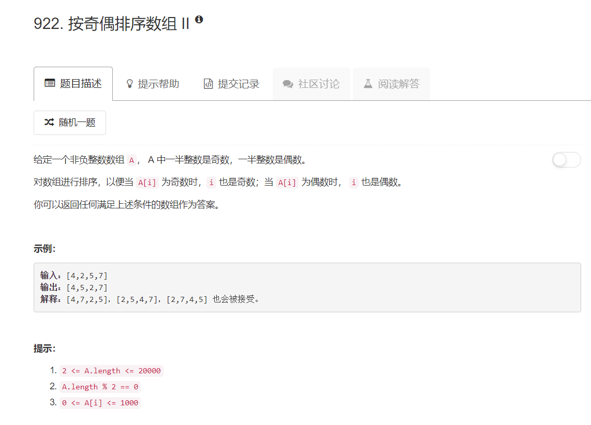

# 922 - 按奇偶排序数组II

## 题目描述


>相似题目：  
[905.按奇偶排序数组](https://github.com/Rosevil1874/LeetCode/tree/master/Python-Solution/905_Sort-Array-By-Parity)

## 题解一
**思路：**    
1. 使用上一题，也就是“按奇偶排序数组”中使用的最简单的方法对数组进行排序，得到前半部分全为偶数，后半部分全为奇数的序列；
2. 有题干中“A.length % 2 == 0”以及题意可得，这个序列刚好一般奇数一半偶数，因此只需将序列后半部分的length-1个奇数向前插入到相应奇数索引中即可，最后一个奇数的索引本为奇数，不用移动。
```python
class Solution:
    def sortArrayByParity(self, A):
        """
        :type A: List[int]
        :rtype: List[int]
        """
        A.sort(key = lambda x: x%2)
        i, j = 1, len(A) - 1
        for k in range(int(len(A)/2 - 1)):
            x = A[j]
            del A[j]
            A.insert(i, x)
            i += 2
        return A
```
虽然通过了，但是这样笨拙的方法速度好慢啊啊


## 题解二
**思路：**  
1. 将原序列的分为一个全为奇数和一个全为偶数的序列；  
2. 构造结果序列，若索引为偶数就从偶数序列中拿一个放到结果序列中，否则从奇数序列中拿一个放到结果序列中。  

PS. 此方法的缺点在于使用了额外的空间，beat 56.36%，跟刚刚几乎最长用时相比以及好很多了。虽然方法简单，但是代码简洁还是参考了别人的。

```python
class Solution:
    def sortArrayByParity(self, A):
        """
        :type A: List[int]
        :rtype: List[int]
        """
        even, odd = [i for i in A if i%2 ==0], [i for i in A if i%2 == 1]
        return [even.pop() if i%2 == 0 else odd.pop() for i in range(len(A))]
        
```


## 题解三
1. 两个指针，分别遍历偶数索引和奇数索引；
2. 移动指针：
    - 若偶数索引指针指向偶数，则指针向后移动到下一个偶数索引处； 
    - 若奇数索引指针指向奇数，则指针向后移动到下一个奇数索引处； 
    - 若以上均不满足，说明两指针刚好指反了，即偶数索引指针指向奇数，奇数索引指针指向偶数，将这两个元素switch一下即可

>此方法不适用额外空间且只遍历一次，beat85.45%，bravo！  
>reference:[Python-one-pass-O(1)-memory-simple-code-beats-90](https://leetcode.com/problems/sort-array-by-parity-ii/discuss/205903/Python-one-pass-O(1)-memory-simple-code-beats-90)  

```python
class Solution:
    def sortArrayByParityII(self, A):
        """
        :type A: List[int]
        :rtype: List[int]
        """
        i, j = 0, 1
        length = len(A)
        while i < length and j < length:
            if A[i]%2 == 0:
                i += 2
            elif A[j]%2 == 1:
                j += 2
            else:
                A[i], A[j] = A[j], A[i]
                i += 2
                j += 2
        return A
```