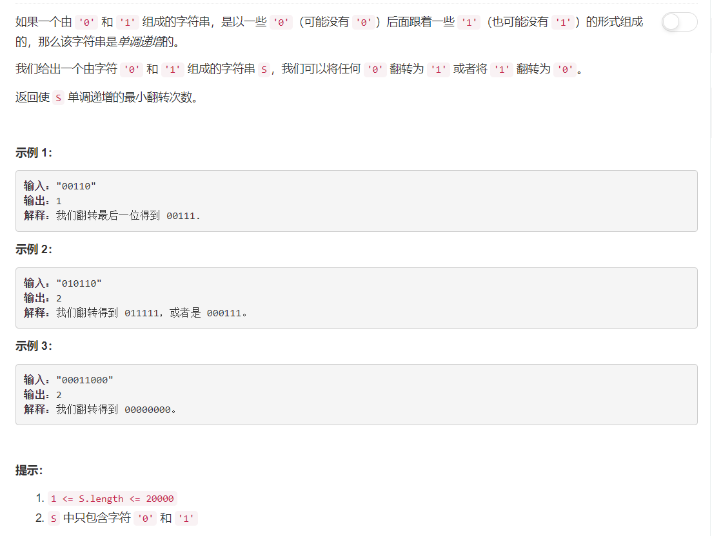

# 926 - 将字符串翻转到单调递增

## 题目描述



## 题解
**思路：**   
遍历数组，对每个由前i（当前遍历索引）个字符组成的子串：
	1. 计算处于0左边的1，以及处于1右边的0的个数；
	2. 最小翻转次数为上面两个值中的较小值；

>referred：[Prefix-Suffix Java O(N) One Pass Solution - Space O(1)](https://leetcode.com/problems/flip-string-to-monotone-increasing/discuss/183896/Prefix-Suffix-Java-O(N)-One-Pass-Solution-Space-O(1))

```python
class Solution(object):
    def minFlipsMonoIncr(self, S):
        """
        :type S: str
        :rtype: int
        """
        # 计算处于0左边的1，以及处于1右边的0的个数
        count1, flipCount = 0, 0
        for i in range(len(S)):
        	if S[i] == '0': 
        		if count1 == 0: continue
        		else: flipCount += 1
        	else:
        		count1 += 1
        	flipCount = min(flipCount, count1)
        	
        return flipCount
```
