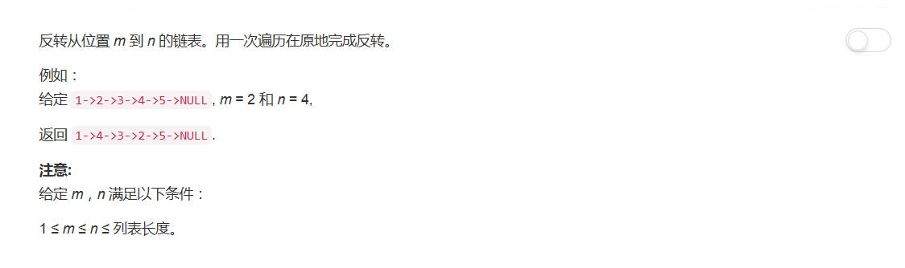

# 92 - 反转链表 II

## 题目描述


>审题：
类似题目：[206.反转链表](https://github.com/Rosevil1874/LeetCode/tree/master/Python-Solution/206_Reverse-Linked-List)

## 一、就地逆置
思路：
1. prev：开始反转的前一个结点
2. start：开始反转的第一个结点
3. then：下一个要插入到prev后面的结点
4. 使用头插法将反转段的结点一个个移动到prev后就行了；

```python
class Solution:
    def reverseBetween(self, head, m, n):
        """
        :type head: ListNode
        :type m: int
        :type n: int
        :rtype: ListNode
        """
        if head is None or head.next is None or m == n:
            return head

        dummy = ListNode(None)
        dummy.next = head
        prev = dummy
        diff = n - m

        while m-1 :
            prev = prev.next
            m -= 1

        start = prev.next
        then = start.next
        while diff:
            start.next = then.next
            then.next = prev.next
            prev.next = then
            then = start.next
            diff -= 1
        return dummy.next
```

## 二、逆置拼接
思路：
1. 将所选段逆置；
2. 将逆置后的子链表与原链表中剩余部分相连。

```python
if head is None or head.next is None or m == n:
    return head

dummy = ListNode(None)
dummy.next = head
curr = dummy

while m-1 :
    curr = curr.next
    m -= 1

prev = curr
front = None
end = curr.next
for i in range( m, n+1 ):
    curr = prev.next
    prev.next = curr.next
    curr.next = front
    front = curr
curr = prev.next
prev.next = front
end.next = curr
return dummy.next
```
