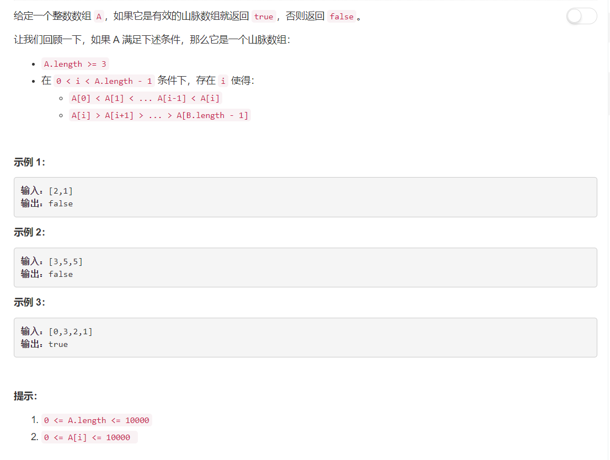

# 941 - 有效的山脉数组

## 题目描述



## 题解
**思路：**  
1. 找出数组的最大值，也就是“山顶”；
2. 以“山顶”为分界点将数组分为left，right两部分；
3. 若left为严格递增，且right为严格递减，则此数组为“山脉数组”，否则不是。

>问题：有一个疑惑就是，这里使用set来对left和right进行去重时，并未对其排序，emmmm搞不懂搞不懂。。。

```python
class Solution:
    def validMountainArray(self, A):
        """
        :type A: List[int]
        :rtype: bool
        """
        lenA = len(A)
        if lenA <= 2:
            return False

        max_pos = A.index(max(A))
        if max_pos == 0 or max_pos == lenA - 1:
            return False

        left, right = A[0:max_pos], A[max_pos:lenA]
        if sorted(list(set(left))) == left and sorted(list(set(right))) == right[::-1]:  
            return True

        return False
```
