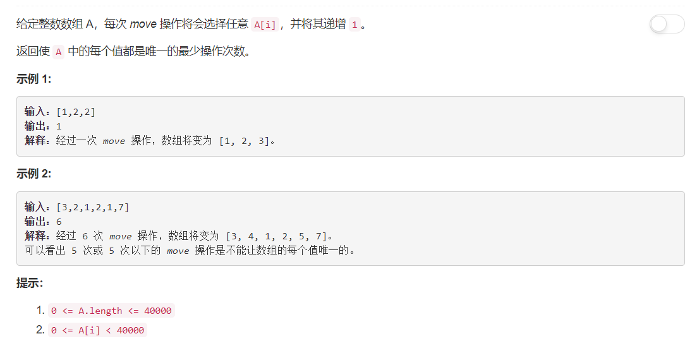

# 945 - 使数组唯一的最小增量

## 题目描述



## 题解
**思路：**  
1. 排序；
2. 逐个检查，后一个数至少比前一个多1，要是不满足就加上。

>时间复杂度： O(NlogN) --排序；
空间复杂度： O(1)

```python
class Solution(object):
    def minIncrementForUnique(self, A):
        """
        :type A: List[int]
        :rtype: int
        """
        count = 0
        A.sort()
        for i in range(1, len(A)):
            if A[i] <= A[i - 1]:
                diff = A[i - 1] - A[i] + 1
                A[i] += diff
                count += diff
        return count
```

版本二：
```python
class Solution(object):
    def minIncrementForUnique(self, A):
        """
        :type A: List[int]
        :rtype: int
        """
        plus, need = 0, 0       # 需要加上plus满足unique，下一个数至少是 need 则满足条件
        for x in sorted(A):
            plus += max(need - x, 0)
            need = max(need + 1, x + 1)
        return plus
```