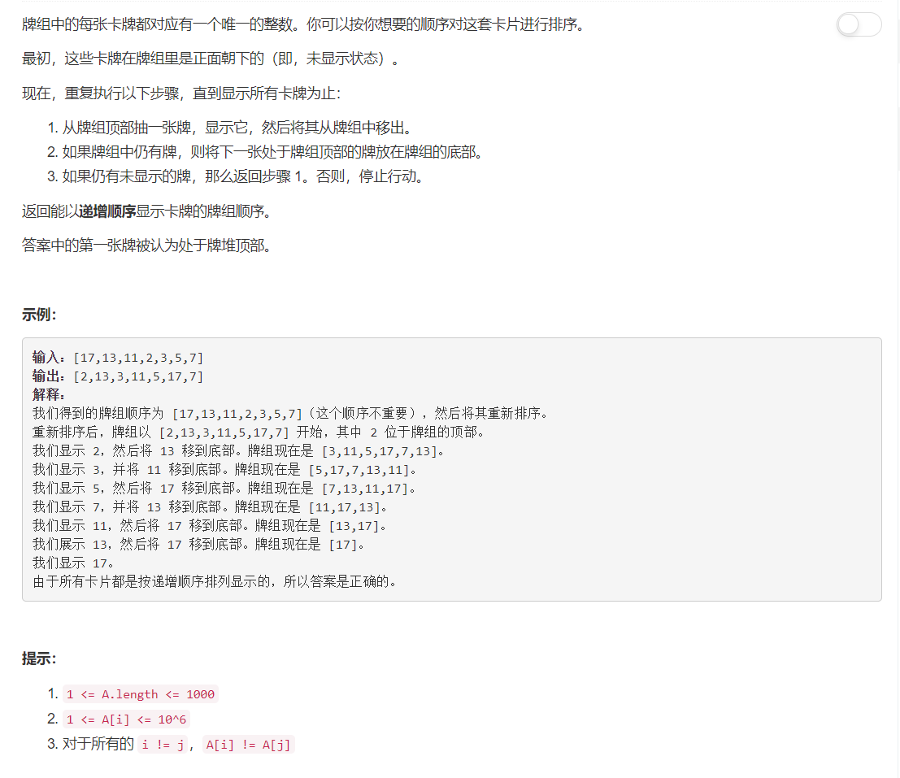

# 950 - 按递增顺序显示卡牌

## 题目描述



## 题解一：队列
**思路如下图：**  


>以为双重循环会超时呢，瑟瑟发抖的我，但并没有哈哈，速度中等。

```python
class Solution(object):
    def deckRevealedIncreasing(self, deck):
        """
        :type deck: List[int]
        :rtype: List[int]
        """
        len_deck = len(deck)
        q = [i for i in range( len_deck )]
        q.reverse()
        index = []
        while len(q) > 0:
            index.append(q.pop())
            if len(q):
                q.insert(0, q.pop())

        res = [0] * len_deck
        deck = sorted(deck)
        for i in range( len_deck ):
            res[index[i]] = deck[i]
        return res
```

deque版：也没有更精简方便啥的。。。   

```python
from collections import deque
class Solution(object):
    def deckRevealedIncreasing(self, deck):
        """
        :type deck: List[int]
        :rtype: List[int]
        """
        len_deck = len(deck)
        q = deque( [i for i in range( len_deck )] )
        index = []
        for i in range(len_deck):
            index.append( q.popleft() )
            if len(q):
                q.append( q.popleft() )

        res = [0] * len_deck
        deck = sorted(deck)
        for i in range( len_deck ):
            res[index[i]] = deck[i]
        return res
```


好了后面两个解法都是大神Lee的作品。

## 题解二：反转
**思路：**其实就是把抽牌的过程逆向工程一下，我一开始也是照这个方向想的，不过脑袋瓜不够灵活没能够想出来，没想到写出来这么简单。。。有点绕还是没理解啊。

```python
class Solution(object):
    def deckRevealedIncreasing(self, deck):
        """
        :type deck: List[int]
        :rtype: List[int]
        """
        d = []
        for x in sorted(deck)[::-1]:
            d = [x] + d[-1:] + d[:-1]
        return d
```

deque版：这个就好理解了嘛。
```python
from collections import deque
class Solution(object):
    def deckRevealedIncreasing(self, deck):
        """
        :type deck: List[int]
        :rtype: List[int]
        """
        d = deque()
        for x in sorted(deck)[::-1]:
            d.rotate()
            d.appendleft(x)
        return list(d)
```