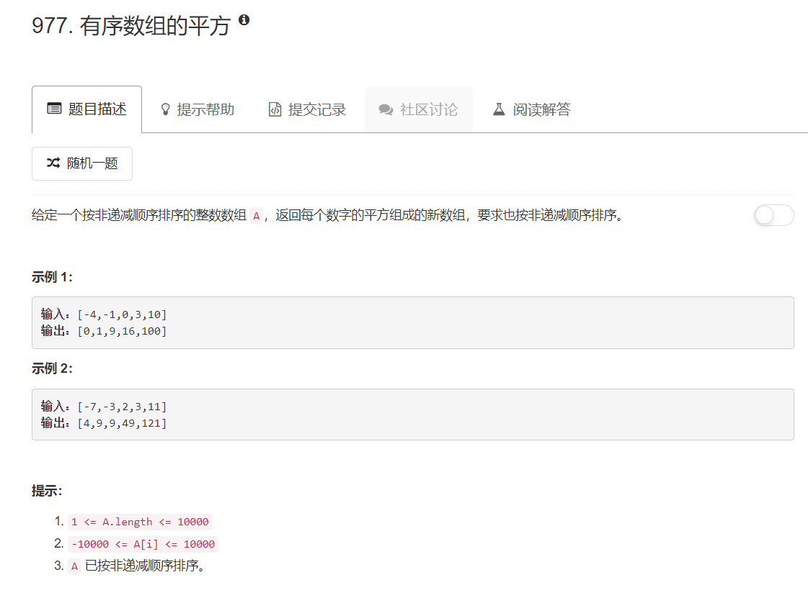

# 977 - 有序数组的平方

## 题目描述


## 题解一【排序】
思路：  直接平方再排序。

```python
class Solution:
    def sortedSquares(self, A: List[int]) -> List[int]:
        A = [x*x for x in A]
        return sorted(A)
```

## 题解二【双指针】
思路：读题的时候看到要求这么简单就觉得一定不是表面上这么简单的，一定有直接平方再排序更好的做法，于是偷偷瞄了一眼解答，果然，双指针可以将时间复杂度从题解一排序的O(NlogN)降低到O(N)，而空间复杂度保持为O(N)。

```python
class Solution:
    def sortedSquares(self, A: List[int]) -> List[int]:
        res = []
        length = len(A)
        i, j = 0, length - 1
        while i <= j:
            square_i = A[i] * A[i]
            square_j = A[j] * A[j]
            if square_i >= square_j:
                res.insert(0, square_i)
                i += 1
            else:
                res.insert(0, square_j)
                j -= 1
        return res
```


## 错误
NameError: name 'List' is not defined

这个List应该是系统里面定义了的，直接在leetcode上面执行而不是自己在本地执行就行了，本地执行应该要自己定义一个List。